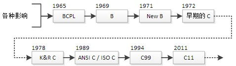

# C语言概述

编程语言类似于人类语言，目的是让计算机理解你的意图，按照你的要求完成指令或工作。高级编程语言由直观的词汇组成，我们很容易就能理解它的意思，它有固定的格式和词汇（不同编程语言的格式和词汇不一样）以及语法，他不仅能够操作计算机完成复杂的指令，更重要的是具备可读性，可以让其他人了解其功能及意图。

C 语言作为最基础的编程语言，除了能让你了解编程的相关概念，带你走进编程的大门，还能让你明白程序的运行原理，比如，计算机的各个部件是如何交互的，程序在内存中是一种怎样的状态

C 语言概念少，词汇少，包含了基本的编程元素，后来的很多语言（C++、Java 等）都参考了 C 语言，说 C 语言是现代编程语言的开山鼻祖毫不夸张，它改变了编程世界。

## 计算机程序

计算机的每一个操作其实都是根据人们事先设定好的指令进行的。而程序就是一组 `有序的` 计算机能够 `识别和执行` 的 `指令`，每一条指令可以使计算机执行特定的操作。一个指令序列可以让计算机完成某一项功能。而计算机要实现各种各样的功能，就需要成千上万个程序。

计算机的一切操作都是由程序控制的，计算机本质上只是一个执行程序的机器。

## 计算机语言

语言的目的是表达意图，人和人之间交流通过语言，前提是这个语言是双方都能识别和理解的，比如中国人和中国人之间交流用中文，而对于一个没有学习过中文的外国人，他们就很难进行沟通。同理，人类想要计算机了解自己的意图也需要通过特定的交流方式，需要一种双方都能识别的语言，这就是计算机语言。

### 计算机语言发展

#### 机器语言

计算机工作基于二进制，从根本上说，计算机只能接收由 0 和 1 组成的指令。在计算机发展的初期，一般计算机的指令长度为16，也就是由16位二进制数组成的一条指令，例如：`0100111000111000`。这种计算机能直接识别和接收的二进制代码称为`机器指令`,机器指令的集合就是该计算机的`机器语言`（machine language）。

机器语言难写、难记、难改、更不容易发现错误，很难进行推广使用，所以在初期只有极少的计算机专业人士可以编写。

#### 符号语言

为了克服`机器语言`的上述缺点，人们创造了`符号语言`（symbolic language），它用一些英文字母和数字表示一个指令，例如：`ADD`代表“加运算”，`SUB`代表“减运算”，`LD`代表“传送”等。
```
ADD A,B // 执行 A + B => A，将寄存器A中的数与寄存器B中的数相加，放到寄存器A中。
```
符号语言计算机并不能直接识别，上文说过计算机只能识别由0和1组成的指令，所以需要将符号语言翻译成计算机能识别的机器语言，这就需要一种称为**汇编程序**的软件。一般，一条符号语言的指令对应转换为一条机器语言的指令。转换过程称为“代真”或者“汇编”，因此，符号语言又称为`符号汇编语言`（symbolic assembler language）或者`汇编语言`（assembler language）。

虽然汇编语言比机器语言简单好记一些，但仍然难以普及，只能在专业人员中使用。而且不同型号的计算机的汇编语言和对应的机器语言是不同的，也就是说在一台计算机上编写的程序，转化为机器指令后，在另一台计算机上很可能无法使用。它完全依赖于具体计算计的特性，是面向机器的语言。由于它“贴近”计算机，也称为计算机`低级语言`（low level language）。

#### 高级语言

为了克服低级语言的缺点，20世纪50年代创造了第一个计算机高级语言：**FORTRAN**。它已经很接近人类的自然语言和数学语言。程序中使用语句和指令是用英文单词表示的，程序中所用的运算符和运算表达式和人们日常使用的数学运算式差不多，容易阅读和理解。程序运行的结果用英文和数字输出，十分方便。例如：输出3.5 X 6sin(π/3)，可以用`PRINT *, 3.5 * 6 * SIN(3.1415 / 3)`来表示。

这种语言功能很强，且不依赖于具体机器，用它写出的程序对任何型号的计算机都适用，它不依赖于机器的特性，距离机器较远，故称为计算机`高级语言`（high level language）。

计算机当然不能直接识别高级语言，也需要转换为机器语言来执行。这个转换过程由一个称为`编译程序`的软件来完成。人们把用高级语言写的程序称为`源程序`（source program）,转换的机器指令称为`目标程序`（object program）。高级语言的一个语句往往对应着多条机器指令。

高级语言易用易学的特点使其得到广泛的传播，使用者可以不必深入探究计算机的内部结构和工作原理，就能得心应手地利用计算机进行各种工作。

数十年来，全世界也涌现出了上千种高级语言，每种语言都有其特定的用途，而高级语言的发展也经历了不同的阶段：

1. 非机构化的语言。初期的语言属于非结构化语言，没有严格的规范和要求，程序在流程中可以随意跳转，程序难以阅读和维护。

2. 结构化语言。为了解决以上的问题，提出了“结构化程序设计方法”，规定程序必须由具有良好特性的基本结构（顺序，分支，循环）构成，程序中不允许随意跳转，程序总是由上而下顺序的执行各个基本结构，这种程序，结构清晰，易于编写和阅读。
>上述的两种语言都是基于过程的语言，在编写程序是需要具体指定每一个执行过程，这样的语言在编写小规模的程序时还能得心应手，但是一旦遇到规模较大的程序时，就会比较吃力。而在经过实践和发展，面向对象程序设计方法被提出来。

3. 面向对象的语言。在近些年计算机应用越来越广，处理问题越来越复杂，单纯的面向过程设计已经很难满足高速开发的需求，于是面向对象的语言得到了广泛的使用和高速的发展。

## C的发展

C 语言的前身是 1967 年由 Martin Richards 为开发操作系统和编译器而提出的两种高级程序设计语言 BCPL 和 B.BCPL。Ken Thompson 在 BCPL 的基础上，提出了新的功能更强的 B 语言，并在 1970 年用 B 语言开发出 UINX 操作系统的早期版本。BCPL 语言和 B 语言都属于“无数据类型”的程序设计语言，即所有的数据都是以“字”（Word）为单位出现在内存中，由程序员来区分数据的类型。

1972 年，贝尔实验室的 Dennis Ritchie 在 BCPL 语言和 B 语言的基础上，又增加了数据类型及其他一些功能，提出了 C 语言，并在 DEC PDP-11 计算机上实现。以编写 UINX 操作系统而闻名的 C 语言，目前已经成为几乎所有操作系统的开发语言。应当指出的是，C 语言的实现是与计算机无关的，只要精心设计，就可以编写出可移植的（Portable）C 语言程序。

到 20 世纪 70 年代末，C 语言已经基本定型，这个 C 语言版本现在被称为“传统 C 语言”。1978 年，Kernighan 和 Ritchie 编著的《C 程序设计语言》出版后，人们开始关注起程序设计语言家族的这个新成员，并最终奠定了 C 语言在程序设计中的地位。《C 程序设计语言》也成为历史上计算机科学领域最成功的专业书籍之一。这本书被C语言开发者们称为“K&R”，很多年来被当作C语言的非正式的标准说明。人们称这个版本的C语言为“K&R C”。

当年 C 语言还是一种与硬件相关的语言，为了让它能够运行于各种类型的计算机上，即各种硬件平台（Hardware platforms）上，人们就提出了多种相似但却常常不能相互兼容的 C 语言版本。这就出现了一个很严重的问题：能够在一台机器上运行的 C 语言程序往往不能够在另外一台机器上运行，除非程序被重新编写。因此，c 语言的标准化呼声日益强烈。1983 年由美国国家标准局（American National Standards Institute，简称 ANSI）开始制定 C 语言标准，于 1989 年 12 月完成，并在 1990 年春天发布，称之为 ANSI C，有时也被称为 C89。

后来 ANSI 把这个标准提交到 ISO（国际化标准组织），1990年被 ISO 采纳为国际标准，称为 ISO C。又因为这个版本是1990年发布的，因此也被称为C90。ANSI C(C89) 与 ISO C(C90)内容基本相同，主要是格式组织不一样。因为 ANSI 与 ISO 的C标准内容基本相同，所以对于C标准，可以称为ANSI C，也可以说是ISO C，或者 ANSI / ISO C。

> 注意：以后大家看到 ANSI C、ISO C、C89、C90，要知道这些标准的内容都是一样的。
> 目前，几乎所有的开发工具都支持 ANSI / ISO C 标准。是C语言用得最广泛的一个标准版本。

在ANSI C标准确立之后，C语言的规范在很长一段时间内都没有大的变动。1995年C程序设计语言工作组对 C语言进行了一些修改，成为后来的1999年发布的 ISO/IEC 9899:1999标准，通常被成为C99。



汇编语言是编程语言的拓荒年代，它非常底层，直接和计算机硬件打交道，开发效率低，学习成本高；

C 语言是面向过程的编程语言，已经脱离了计算机硬件，可以设计中等规模的程序；

Java、C++、Python、C#、PHP 等是面向对象的编程语言，它们在面向过程的基础上又增加了很多概念。

C 语言出现后不久，计算机产业开始爆发，计算机硬件越来越小型化，越来越便宜，逐渐进入政府机构，进入普通家庭，C 语言成了编程的主力军，获得了前所未有的成功，操作系统、常用软件、硬件驱动、底层组件、核心算法、数据库、小游戏等都使用 C 语言开发。

### 特点

1. 语言简洁紧凑，使用方便灵活，程序设计自由度大。
2. 具有丰富的数据类型。
3. 具有丰富的运算方式和表达方式。
4. 面向结构化，具有结构化控制语句。
5. 可以直接访问物理地址，进行位操作，可以直接对硬件进行操作。
6. 生成代码质量高，程序执行效率高。
7. 移植性好。

> C 语言无时无刻不在谈内存，内存简直就是如影随形，你不得不去研究它。
