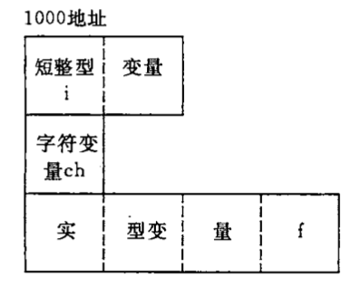

# 共用体

## 什么是共用体

有时候想用同一段内存存放不同类型的变量。例如，把一个短整型变量、一个字符型变量和一个实型变量放在同一地址开始的内存单元中。以上 3 个变量在内存中所占的字节不同，但是都是从同一地址开始存放，也就是使用覆盖技术，后一个数据覆盖了前面的数据。这种使几个不同的变量共享同一段内存的结构，称为“共用体”类型的结构。



定义共用体型变量的一般形式为：

```
union 共用体名
{
  成员列表
} 变量列表；

例：

union Data{
  int i;
  char ch;
  float f;
} a,b;

union Data c;
```

共用体与结构体的定义形式相似。但它们的含义是不同的。结构体变量所占内存长度是各个成员所占的内存长度之和。每个成员分别占有其自己的内存单元。而共用体变量所占的内存长度等于最长的成员的长度。例如，上面定义的共用体变量a,b,c各占4个字节。

## 引用共用体变量

只有先定义了共用体变量才能引用它，但应该注意，不能引用共用体变量，而只能引用共用体变量中的成员。

```
a.i; // 引用共用体变量中的整型变量i
a.ch; // 引用变量ch
a.f; // 引用变量f
```

## 数据的特点

1. 同一内存段可以用来存放几种不同类型的成员，但是在每一瞬时只能存放其中一个成员，而不是同时存放几个。其道理是显然的，因为在每一个瞬时，存储单元只能有唯一的内容，也就是说在共用体变量中只能存放一个值。

2. 可以对共用体变量初始化，但初始化表中只能有一个常量。
```
union Data{
  int i;
  char ch;
  float f;
}a = {.ch = 'c'};
```

3. 共用体变量中起作用的成员是最后一次被赋值的成员，在对共用体变量中的一个成员赋值后，原有变量存储单元中的值就取代。

4. 共用体变量的地址和它的各个成员的地址都是同一地址。例如：`&a.i`，`&a.ch`，`&a.f`，都是同一值。

5. 不能对共用体变量赋值，也不能企图引用变量名来得到一个值。

6. C99可以允许将共用体作为函数参数，也可以使用指向共用体变量的指针作为参数。

7. 共用体类型可以出现在结构体类型定义中，也可以定义共用体数组。反之，结构体也可以出现在共用体类型定义中，数组也可以作为共用体的成员。
