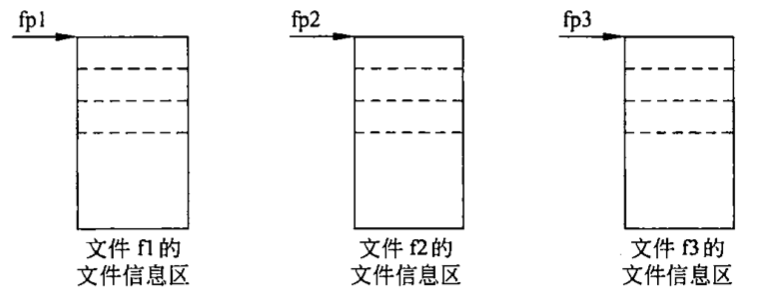

# 对文件的输入输出

## 文件基础知识

在程序设计中，主要用到两种文件：

1. 程序文件。包括源程序文件、目标文件、可执行文件等。这种文件的内容是程序代码。

2. 数据文件。文件的内容不是程序，而是供程序运行时读写的数据，如在程序运行过程中输出到磁盘（或其他外部设备）的数据，或在程序运行过程中供读入的数据。

程序中常用的输入输出都是以终端为对象的，即从终端的键盘输入数据，运行结果输出到终端显示器。实际上也需要将一些数据（运行的最终结果或中间数据）输出到磁盘上保存起来，以后需要时再从磁盘中输入到计算机内存。这就需要用到磁盘文件。

为了简化用户对输入输出设备的操作，使用户不必去区分各种输入输出设备之间的区别，**操作系统把各种设备都统一作为文件来处理**。从操作系统的角度看，每一个与主机相连的输入输出设备都看作一个文件。

所谓文件一般是指存储在外部介质上数据的集合。操作系统是以文件为单位对数据进行管理的。也就是说，如果想找存放在外部介质上的数据，必须先按文件名找到所指定的文件，然后再从该文件中读取数据。要向外部介质上存储数据也必须先建立一个文件（以文件名作为标志），才能向它输出数据。

输入输出是数据传送的过程，数据如流水一样从一处流向另一处，因此常将输入输出形象地成为流（stream），即**数据流**。流表示了信息从**源**到**目的**端的流动。在输入操作时，数据从文件流向计算机内存，在输出操作时，数据从计算机流向文件。文件是由运行环境（操作系统）进行统一管理的。“流”是一个传输通道，数据可以从运行环境流入程序中，或从程序流至运行环境。

无论程序一次读写一个字符，或一行文字，或一个指定的数据区，作为输入输出的各种文件或设备都是统一以逻辑数据流的方式出现的。C 语言把文件看作是一个字符（或字节）的序列，即由一个个字符（或字节）的数据顺序组成。一个输入输出流就是一个字符流或字节流。

C 的数据文件由一连串的字符（或字节）组成，而不考虑行的界限，两行数据间不会自动加分隔符，对文件的存取是以字符（字节）为单位的。输入输出数据流的开始和结束仅受程序控制而不受物理符号控制，这种文件称为流式文件。

### 文件名

一个文件要有一个唯一的文件标识，以便用户识别和引用。文件标识包括 3 部分：

1. 文件路径
2. 文件名主干
3. 文件后缀


文件标识常被称为**文件名**，

### 文件的分类

根据数据的组织形式，数据文件可分为 ASCII 文件和二进制文件。数据再内存中是以二进制形式存储的，如果不加转换地输出到外存，就是二进制文件，可以认为它就是存储在内存的数据的映像，所以也称之为映像文件（image file）。如果要求在外存上以 ASCII 代码形式存储，则需要在存储前进行转换。ASCII 文件又称文本文件，每一个字节放一个字符的 ASCII 代码。

一个数据再磁盘上怎样存储：字符一律以 ASCII 形式存储，数值型数据既可以用 ASCII 形式存储，也可以用二进制形式存储。如有整数 10000，如果用 ASCII 码形式输出到磁盘，则占 5 个字节（每个字符占一个字节），而用二进制形式输出，则在磁盘上只占 4 个字节。

用 ASCII 码形式输出时字节与字符一一对应，一个字节代表一个字符，因而便于对字符进行逐个处理，也便于输出字符。但是一般占储存空间较多，而且要花费转换时间（二进制形式与 ASCII 码间的转换）。用二进制形式输出数值，可以节省外存空间和转换时间，把内存中的存储单元中的内容原封不动地输出到磁盘（或其他外部介质）上，此时每一个字节并不一定代表一个字符。如果程序运行过程中有的中间数据需要保存在外部介质上，以便在需要时再输入到内存，一般用二进制文件比较方便。在事务管理中，常有大批数据存放在磁盘上，随时调入计算机进行查询或处理，然后又把修改过的信息再存回磁盘，这时也常用二进制文件。


### 常见三种字符编码的区别：ASCII、Unicode、UTF-8

[详情](https://www.cnblogs.com/zhaokunbokeyuan256/p/7680337.html)

### 文件缓冲区

ANSI C 标准采用“缓冲文件系统”处理数据文件，所谓缓冲文件系统是指系统自动地在内存区为程序中每一个正在使用的文件开辟一个文件缓冲区。从内存向磁盘输出数据必须先送到内存中的缓冲区，装满缓冲区后才一起送到磁盘去。如果从磁盘向计算机读入数据，则一次从磁盘文件将一批数据输入到内存缓冲区（充满缓冲区），然后再从缓冲区逐个地将数据送到程序数据区（给程序变量）。

由于 CPU 与 I/O 设备间速度不匹配。为了缓和 CPU 与 I/O 设备之间速度不匹配矛盾。文件缓冲区是用以暂时存放读写期间的文件数据而在内存区预留的一定空间。使用文件缓冲区可减少读取硬盘的次数。


### 文件类型指针

缓冲文件系统中，关键概念是“文件类型指针”，简称“文件指针”。每个被使用的文件都在内存中开辟一个相应的文件信息区，用来存放文件的有关信息（如文件的名字、文件状态及文件当前位置等）。这些信息是保存在一个结构体变量中的。该结构体类型是由系统声明的取名为 FILE。例如：

```
typedef struct {
  short level;              // 缓冲区“满”或“空”的程度
  unsigned flags;           // 文件状态标志
  char fd;                  // 文件描述符
  unsigned char hold;       // 如缓冲区无内容不读取字符
  short bsize;              // 缓冲区大小
  unsigned char *buffer;    // 数据缓冲区的位置
  unsigend char *curp;      // 指针当前的指向
  unsigned istemp;          // 临时文件指示器
  short token;              // 用于有效性检查
} FILE;

```

不同的 C 编译系统的 FILE 类型包含的内容不完全相同，但大同小异。

`FILE f1;`

定义了一个结构体变量 f1，用它来存放一个文件的有关信息。这些信息是在打开文件时由系统根据文件的清凉自动放入的。

一般不对 FILE 类型变量命名，也就是不通过变量的名字来引用这些变量，而是设置一个指向 FILE 类型变量的指针变量，然后通过它来引用这些 FILE 类型变量。这样使用起来方便。

```
FILE *fp;
```

定义 fp 时一个指向 FILE 类型数据的指针变量。可以使 fp 指向某一个文件的文件信息区（是一个结构体变量），通过该文件信息区中的信息就能够访问该文件。也就是说，**通过文件指针变量能找到与它关联的文件**。如果有 n 个文件，应设置 n 个指针变量，分别指向 n 个 FILE 类型变量，以实现对 n 个文件的访问：



> 指向文件的指针变量并不是指向外部介质上的数据文件的开头，而是指向内存中的文件信息区的开头。

## 打开和关闭文件

对文件读写之前应该“打开”该文件，在使用结束之后应该“关闭”该文件。“打开”和“关闭”是形象地说法，实际上，所谓“打开”是指为文件简历相应的信息区（用来存放有关文件的信息）和文件缓冲区（用来暂时存放输入输出的数据）。

在编写程序时，在打开文件的同时，一般都指定一个指针变量指向该文件，也就是简历起指针变量与文件之间的联系，这样，就可以通过该指针变量对文件进行读写了。所谓“关闭”是指撤销文件信息区和文件缓冲区，使文件指针变量不再指向该文件，显然就无法进行对文件的读写了。

### fopen

ANSI C 规定了用标准输入输出函数`fopen`来实现打开文件。

`fopen(文件名,使用文件方式);`

```c
fopen("a1","r");
```

表示要打开名字为“a1”的文件，使用文件方式为“读入”（r 代表 read）。fopen 函数的返回值是指向 a1 文件的指针（即 a1 文件信息区的起始地址）。通常将 fopen 函数的返回值赋值给一个指向文件的指针变量。

```c
FILE *fp;
fp = fopen("a1","r");
```

这样 fp 就和文件 a1 相联系了，或者说，fp 指向了 a1 文件。可以看出，在打开一个文件时，通知编译系统以下 3 个信息：① 需要打开文件的名字，也就是准备访问的文件的名字；② 使用文件的方式（“读”还是“写”）；③ 让哪一个指针变量指向被打开的文件。


> 如果不能实现“打开”的任务，fopen 函数将带回一个出错信息。出错的原因可能是：用“r”方式打开一个不存在的文件；磁盘出故障；磁盘已满无法建立新文件等。此时 fopen 函数将带回一个空指针值 NULL

```
if (fp = fopen("a1","r") == NULL){
  printf("can not open file");
  exit(0);
}
```

即先检查打开文件是否出错，如果有错就在终端上输出错误提示。`exit`函数的作用是关闭所有文件，终止正在执行的程序，待用户检查出错误，修改后重新运行。

C 标准建议用上文表中列出的文件使用方式打开文本文件或二进制文件，但目前使用的有些 C 编译系统可能不完全提供所有这些功能（有些只能用“r”，“w”，“a”方式），有些 C 版本不用“r+”、“w+”、“a+”，而用“rw”、“wr”、“ar”等。

计算机从 ASCII 文件读入字符时，遇到回车换行符，系统把它转换为一个换行符，在输出时把换行符转换成回车和换行符两个字符。在用二进制文件时，不进行这种转换，在内存中的数据形式与输出到外部文件中的数据形式完全一致，一一对应。

程序中可以使用 3 个标准的流文件：**标准输入流**、**标准输出流**、**标准出错输出流**。系统已对这三个文件指定了与终端的对应关系。标准输入流是从终端的输入，标准输出流是向终端的输出，标准出错输出流是当程序出错是将出错信息发送到终端。

程序开始运行时，系统自动打开这 3 个标准流文件。因此，程序编写者不需要在程序中用 fopen 函数打开。系统定义了 3 个文件指针变量`stdin`，`stdout`，`stderr`，分别指向上述三个流文件。它们都以终端作为输入输出对象。如果程序中指定要从`stdin`所指的文件输入数据，就是指从终端键盘输入数据。

### fclose

在使用完一个文件后应该关闭它，以防止它被再误用。“关闭”就是撤销文件信息区和文件缓冲区，使文件指针变量不再指向该文件，也就是文件指针变量与文件“脱钩”，此后不能再通过该指针对原来与其相联系的文件进行读写操作，除非再次打开，使该指针变量重新指向该文件。

`fclose(文件指针);`

```c
fclose(fp);
```

如果不关闭文件将会丢失数据。因为，在向文件写数据时，是先将数据输出到缓冲区，待缓冲区充满后才正式输出给文件。如果当数据未能充满缓冲区而程序结束运行，就有可能使缓冲区中的文件数据丢失。要用 fclose 函数关闭文件，先把缓冲区中的数据输出到磁盘文件，然后才撤销文件信息区。有的编译系统在程序结束前会自动先将缓冲区中的数据写到文件，从而避免了这个问题。但还是应当养成在程序终止之前关闭所有文件的习惯。

fclose 函数也带回一个值，当成功地执行了关闭操作，则返回值为 0；否则返回 EOF(-1)。

## 顺序读写数据文件

文件打开之后，就可以对它进行读写了。在顺序读写时，先写入的数据存放在文件中前面的位置，后写入的数据存放在文件中后面的位置。在顺序读写时，先读文件中前面的数据，后读文件中后面的数据。也就是说，对顺序读写来说，对文件读写数据的顺序和数据在文件中的屋里顺序是一致的。顺序读写需要用库函数实现。

### 向文件读写字符

读写一个字符的函数：


实例 1：从键盘输入字符，写入到文件中

```c
#include <stdio.h>
#include <stdlib.h>

int main(int argc, const char * argv[]) {
    // insert code here...

    FILE *fp; // 定义一个指向文件的指针变量
    char ch; // 定义一个char类型变量用来接收字符

    fp = fopen("/Users/zhxh/Downloads/OTHER/test.txt", "wr"); // 打开文件，并使fp指向此文件
    if (fp == NULL) {
        printf("open file fail");
        exit(0);
    }


    printf("请输入内容");
    ch = getchar();
    while (ch != '#') {
        fputc(ch, fp);
        putchar(ch);
        ch = getchar();
    }

    fclose(fp);
    putchar('\n'); // 输入一个换行符

    return 0;
}
```

> （1）用来存储数据的文件名可以在 fopen 函数中直接写成字符串常量形式：`"filename.xxx"`，也可以用`scanf`函数让用户指定。

> （2）用`fopen`函数打开一个“只写”的文件（“w”表示只能写入不能从中读取数据），如果打开文件成功，函数的返回值是该文件所建立的信息区的起始地址，把它赋给指针变量 fp。如果不能成功的打开文件，则使用 printf 函数输出提示信息，然后用 exit 函数终止程序运行。

> （3）exit 是标准 C 的函数库，作用是使程序终止，用此函数时在程序的开头应该包含`stdlib.h`头文件。

> （4）用 getchar 函数接收用户从键盘输入的字符。每次只能接收到一个字符。当接收到“#”字符时结束接收，“#”是人为指定的，可以根据需要修改结束标志。

> （5）执行过程是：先从键盘读入一个字符，检查它是否是结束标志，如果是表示字符串已结束，不做循环，如果不是，则执行循环体，逐个接收字符并写入到磁盘文件，然后再屏幕上显示出改字符，接着再从键盘读入一个字符。如此反复，直到接收到结束标志。

> （6）检查文件是否写入内容

实例 2：把一个文件中的内容复制到另一个文件

```c
#include <stdio.h>
#include <stdlib.h>


void readFromFile(){

    FILE *in,*out;
    char ch;
    in = fopen("/Users/zhxh/Downloads/OTHER/test.txt", "r");
    out = fopen("/Users/zhxh/Downloads/OTHER/test_copy.txt", "w");
    if (in == NULL || out == NULL) {
        printf("can not open file");
        exit(0);
    }

    while (!feof(in)) {
        ch = fgetc(in);
        fputc(ch, out);
        putchar(ch);
    }

    putchar('\n');

}


int main(){

  return 0;
}

```

> `feof(FILE *)`

> （1）在访问磁盘文件时，是逐个字符（字节）进行的，为了知道当前访问到第几个字节，系统用“文件读写位置标记”来表示当前访问的位置。开始时“文件读写位置标记”指向第 1 个字节，每访问完一个字节后，当前读写位置就指向下一个字节，即当前读写位置自动后移。

> （2）为了知道对文件的访问是否完成，只需看文件读写位置是否移动到文件的末尾。用`feof`函数可以检查到文件读写位置是否移到文件的末尾，即磁盘文件是否结束。

### 向文件读写字符串

读写一个字符串函数：


`char * fgets(char *str, int n, FILE *fp);`：从文件读入一个字符串。

其中`n`是要求得到的字符个数，但实际上只从 fp 所指向的文件中读入 n-1 个字符，然后在最后加一个'\0'字符，这样得到的字符串共有 n 个字符，把他们放到字符数组 str 中。如果在读完 n-1 个字符之前遇到换行符'\n'或文件结束符 EOF，读入即结束，但将所遇到的换行符也作为一个字符读入。若执行 fgets 函数成功，则返回值为 str 数组首元素的地址，如果一开始就遇到文件尾或读数据出错，则返回 NULL。

`int fputs(char *str, FILE *fp);`：将 str 所指向的字符串输出到 fp 所指向的文件中。该函数返回一个非负值，如果发生错误则返回 EOF。

第一个参数 str 可以是字符串常量、字符串数组名或字符型指针。字符串末尾的'\0'不输出。若输出成功，函数值为 0；失败时，函数的值为 EOF。

```c
void readWriteString() {
    FILE *fp;
    fp = fopen("/Users/zhxh/Downloads/OTHER/string_test.txt", "w");
    if (fp == NULL) {
        printf("打开文件失败");
        exit(0);
    }
    int result = fputs("哈哈哈哈哈", fp);
    if (result != EOF) {
        printf("写入成功");
    }
    fclose(fp);
}
```

### 格式化方法读写文件

前面进行的字符的输入输出，而实际上数据的类型是丰富的。我们经常使用`printf`函数和`scanf`函数向终端进行格式化的输入输出，即用各种不同的格式以终端为对象输入输出数据。其实也可以对文件进行格式化输入输出，这时候就要用`fprintf`和`fscanf`函数。

`fprintf(文件指针，格式字符串，输出列表)`

`fscanf(文件指针，格式字符串，输入列表)`

```c
FILE *fp = fopen("xxx","w");
int i = 100;
double f = 3.15;
// 写入文件
fprintf(fp,"%d,%f",i,f);
// 从文件读取
fscanf(fp,"%d,%f",&i,&f);
```

### 用二进制方式向文件读写数据

在程序中不仅需要一次输入输出一个数据，而且常常需要一次输入输出一组数据（如数组或结构体变量的值），C 语言允许用 fread 函数从文件中读一个数据块，用 fwrite 函数向文件写入一个数据块。在读写时是以二进制形式进行的。在向磁盘写数据时，直接将内存中一组数据原封不动、不加转换地复制到磁盘文件上，在读入时也是将磁盘文件中若干字节的内容一批读入内存。

`fread(buffer,size,count,fp);`

`fwrite(buffer,size,count,fp);`

buffer：是一个地址。对 fread 来说，它是用来存放从文件读入的数据的存储区的地址。对 fwrite 来说，是要把此地址开始的存储区中的数据向文件输出。

size：要读写的字节数。

count：要读写多少个数据项（每个数据项长度为 size）。

fp：FILE 类型指针。

## 随机读写数据文件

对文件进行顺序读写比较容易理解，也容易操作，但有时候效率不高，例如文件中有 1000 个数据，若只查找第 1000 个数据，必须先逐个读入前 999 个数据才能读入到第 1000 个数据。如果文件中存放一个城市人口的资料，若按此方法查询，效率太低。

随机访问并不是按数据在文件的物理位置次序进行读写，而是可以对任意位置上的数据进行访问。

### 文件位置标记及其定位

1. 文件位置标记

为了对读写进行控制，系统为每个文件设置了一个文件读写位置标记（简称文件位置标记或文件标记），用来指示“接下来要读写的下一个字符的位置”。

一般情况下，在对字符文件进行顺序读写时，文件位置标记指向文件开头，这时如果对文件进行读的操作，就读第 1 个字符，然后文件位置标记向后移动一个位置，在下一次执行读的操作时，就将位置标记指向的第二个字符读入。依次类推，直到遇到文件尾，结束。


如果是顺序写文件，则每写完一个数据后，文件位置标记顺序向后移一个位置，然后在下一次执行写操作时把数据写入指针所指的位置。直到把数据全部写完，此时文件位置标记在最后一个数据之后。

可以根据读写的需要，人为地移动文件位置标记的位置。文件位置标记可以向前移，向后移，移到文件头或者移到文件尾，然后对该位置进行读写，显然这就不是顺序读写了，而是随机读写。

对流式文件既可以进行顺序读写，也可以进行随机读写。关键在于控制文件的位置标记。如果文件位置标记是按照字节位置进行顺序移动的，就是顺序读写。如果能将文件位置标记按需要移动到任意位置，就可以实现随机读写。所谓随机读写，是指度写完上一个字符（字节）后，并不一定要读写其后续的字符（字节），而可以读写文件中任意位置上所需要的字符（字节）。即对文件读写数据的顺序和数据在文件中的物理顺序一般是不一致的。

2. 文件位置标记的定位

可以强制使文件位置标记指向人们指定的位置。

1. 使用`rewind`函数使文件位置标记指向文件开头。`rewind`函数的作用是使文件位置标记重新返回文件的开头，此函数没有返回值。

2. 用`fseek`函数改变文件位置标记。`fseek`函数的调用形式为：`fseek(文件类型指针,位移量,起始点)`。“起始点”用 0、1 或 2 代替，0 代表“文件开始位置”，1 为“当前位置”，2 为“文件末尾位置”。


“位移量”指以“起始点”为基点，向前移动的字节数。位移量应是long型数据（在数字的末尾加一个字母L，就表示long型）。

```c
fseek(fp,100L,0); // 将文件位置标记向前移到离文件开头100个字节处
fseek(fp,50L,1); // 将文件位置标记向前移到离当前位置50个字节处
fseek(fp,-10L,2); // 将文件位置标记从文件末尾处向后退10个字节
```

3. 用`ftell`函数测定文件位置标记的当前位置。`ftell`函数的作用是得到流式文件中文件位置标记的当前位置。由于文件中的文件位置标记经常移动，人们往往不容易知道其当前位置，所以常用`ftell`函数得到当前位置，用相对于文件开头的位移量来表示。如果调用函数时出错（如不存在fp指向的文件）`ftell`函数返回值为-1L。

```c
i = ftell(fp);
if (i == -1L) printf("error! \n");
```

### 随机读写

使用`rewind`和`fseek`函数就可以实现随机读写。

实例：5个学生的成绩读取

```c
#include <stdio.h>
#include <stdlib.h>

int main(){

  struct Student {
    int num;
    char *name;
    float score;
  } students[5];

    


  return 0;
}

```