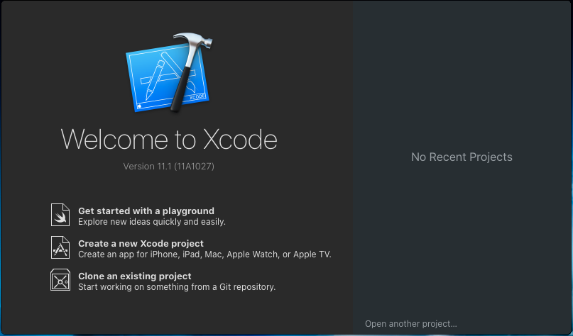
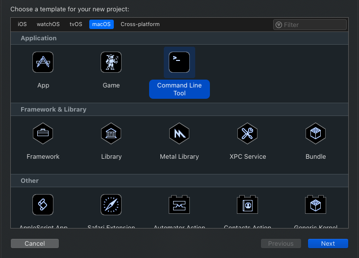
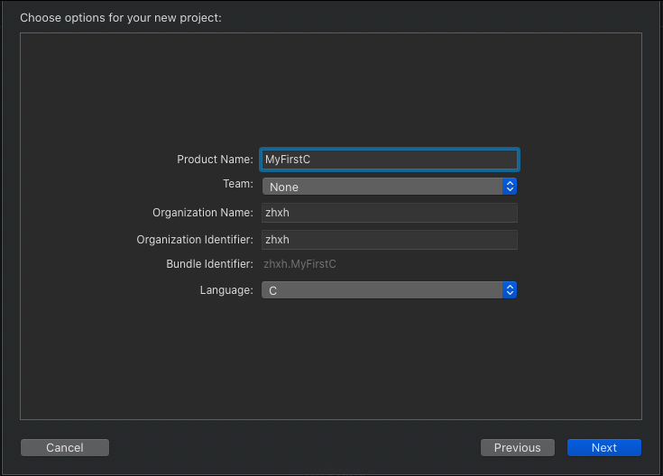
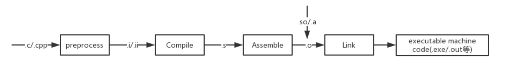
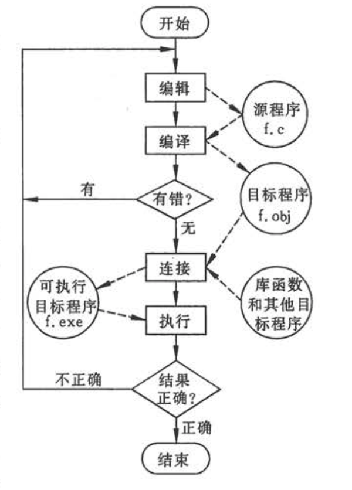

# C语言程序

```c
#include <stdio.h>
int main(){
  printf("This is a C Program!");
  return 0;
}
```

## 编写源程序

### 环境准备

#### MacOS

1. 下载 Xcode 并安装

2. 打开 Xcode 欢迎界面



3. 选择`Create a new Xcode project`创建项目，类型选择`MacOS` > `Application` > `Command Line Tool`



4. 填入项目信息，选择项目存储位置



### 程序编译过程

计算机不能直接执行 C 语言代码，需要经过编译器编译后形成机器可识别的指令。

宏义上的编译是指程序从源文件到二进制程序的全部过程，该过程包含预处理、编译、汇编、链接四个阶段。或者是从源文件到二进制文件的全过程，也就是生成.o 文件的过程，该过程包含预处理、编译、汇编三个阶段。狭隘的编译就只是将.i 文件转化成.s 文件的过程。通常我们所说的编译就是宏义上的编译。

1. **预处理**：在编译之前由预处理器对源码进行的处理。主要包括宏替换、删除注释、执行预处理命令入#include、#ifdef 等，生成.i 文件。预处理后的文件会比源文件大很多，因为#include 执行了复制，就此时文件仍然可以以文稿形式打开。
2. **编译**：将源码转化成汇编代码生成.s 文件。汇编之后的.s 文件都是汇编指令，比如 movl、call 等。此时文件仍然可以以文稿形式打开。
3. **汇编**：将汇编语言转化成机器码，生成.o 文件。生成.o 文件就是机器码了，不能使用文稿打开。
4. **链接**：编译之后的文件还不能直接执行，因为一个项目中存在多个文件，文件之间有引用关系，将这些文件进行关联并最终生成可执行程序的过程就是链接。




## 程序结构

1. 一个 C 语言程序包含一个或多个源程序文件也称源文件（.c）。一个源程序文件可包括3部分：
    1. **预处理指令**。C编译系统在对源程序进行“翻译”以前，先由一个“预处理器”（也称“预处理程序”、“预编译器”）对预处理指令进行预处理。由预处理得到的结果与程序其他部分一起，组成一个完整的、可以用来编译的最后的源程序，然后由编译程序对该源程序正式进行编译，才得到目标程序。
    2. **全局声明**。即在函数之外进行的数据声明。在函数外面声明的变量称为全局变量，全局变量在整个源程序文件范围内有效。在函数中声明的变量是局部变量，只在函数范围内有效。
    3. **函数定义**。定义一个函数，用于实现一定的功能。

2. 一个源文件中包含一个或多个函数，函数时C程序的主要组成部分。程序的几乎全部工作都是由各个函数分别完成的，函数是C程序的基本单位，每个函数都用来实现一个或几个特定的功能。编写C程序的工作主要就是编写一个个函数。
3. 一个源程序必须有且只有一个主函数`main()`。

4. 一个函数包括两部分。
    1. 函数首部。包含函数名、函数类型、函数属性、函数参数（形参）、参数类型。
    2. 函数体。

5. 程序总是从main函数开始执行的，而不论main函数在整个程序中的位置如何。

6. 程序中对计算机的操作是由函数中的C语句完成的。如赋值、输入输出等操作都是由对应的C语句实现的。

7. 每个语句均以`;`结束，预处理指令和函数花括号后可不加分号。

8. 关键字和标识符之间用一个以上的空格进行区分。

9. C语言本身不提供输入输出语句。输入输出的操作是由库函数scanf和printf等函数来完成的。C对输入输出实行“函数话”。由于输入输出操作涉及具体计算机设备，把输入输出操作用库函数实现，就可以使C语言本身的规模较小，编译简单。

10. 程序应当包含注释。增加可读性和可维护性。

## 程序运行的步骤



1. 编辑源程序。

2. 编译。先用预处理器对程序中的预处理指令进行预处理，由预处理得到的信息与程序其他部分一起，组成一个完整的，可以用来进行正式编译的源程序，然后由编译系统对该源程序进行编译。编译的作用首先是对源程序进行检查，判定它有无语法方面的错误。在确定没有语法错误后，将源程序转换为二进制的目标程序。
> 编译系统对源程序进行编译时，自动包括了预编译和正式编译两个阶段。

3. 连接。经过编译所得到的的二进制目标文件，还不能提供计算机直接执行。因为一个程序可能包含若干个源程序文件，而编译是以源程序文件为对象的，一次编译只能得到与一个源程序文件相对应的目标文件（也称目标模块），它只是整个程序的一部分。必须把所有的编译后得到的目标模块连接装配起来，在于函数库相连接成一个整体，生成一个可供计算机执行的目标程序，成为可执行程序。
> 即使一个程序只包含一个源程序文件，编译后得到的目标程序也不能直接运行，也要经过连接阶段，因为要与函数库进行连接，才能生成可执行程序。

> 连接工作是由一个称为“连接编辑程序”的软件来实现的。

4. 运行。一个程序从编写到完美运行，并不是一次就可以成功的，往往要经过反复多次的修改。即使运行成功也不能保证程序正确无误，除了人工方法检查外，还需借助编译系统来检查语法问题，通过不断的测试来确保逻辑的正确。


## 程序设计的目标

从确定问题到最后完成任务一般经过下面几个阶段：

1. 问题分析

2. 设计算法

3. 编写程序

4. 对源程序进行修改，编译等，得到可执行程序。

5. 运行程序，对结果进行分析

6. 编写程序文档

## 简单示例

### 求两数之和

```c
#include <stdio.h>

int main(){

  int a = 100;
  int b = 20;
  int sum = sum(a,b);
  return 0;
}

// 求两数之和

int sum(int a, int b){
  return a + b;
}

```

### 求两数中的最大者

```c
#include <stdio.h>

int main(){
  int max(int x, int y);  // 因为函数的定义在下面，所以需要对函数进行声明
  int a = 100;
  int b = 20;
  int max = max(a,b);
  return 0;
}

int max(int a, int b){
  return a >= b ? a : b;  // 利用三元运算符输出结果
}
```

### 求三个数的最大者

```c
#include <stdio.h>

int main(){

  return 0;
}

int max(int a, int b, int c){
  int max = a >= b ? a : b;
  max = max >= c ? max : c;
  return max;
}

```