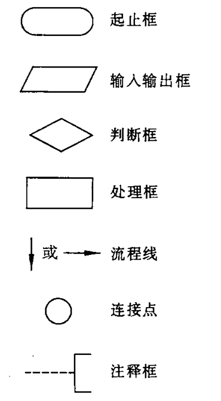
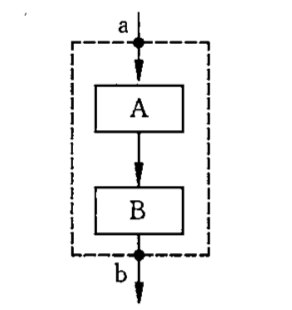
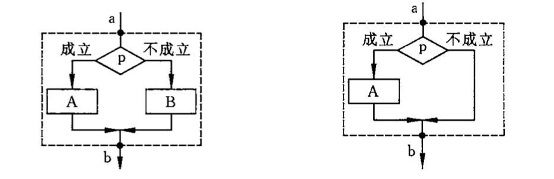
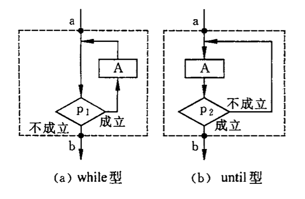
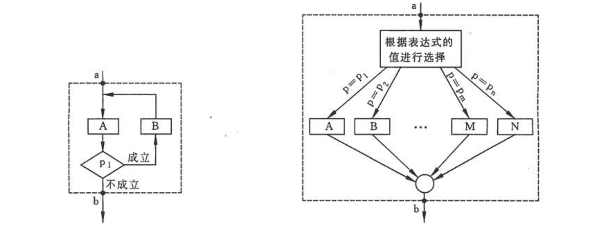
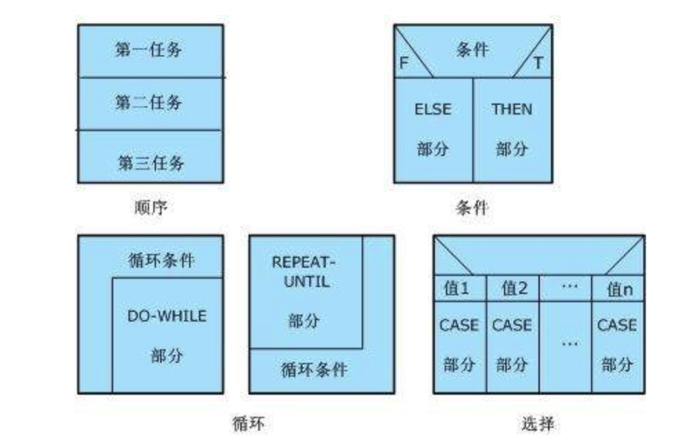
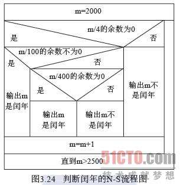

# 算法

一个程序主要包括以下两方面信息：

1. 对**数据**的描述。在程序中腰肢定用到哪些数据以及这些数据的类型和数据的组织形式。这就是`数据结构`。

2. 对**操作**的描述。即要求计算机进行操作的步骤，也是`算法`（algorithm）。

数据是操作的对象，操作的目的是对数据进行加工处理，以得到期望的结果。所以程序设计人员必须认真考虑和设计数据结构和操作步骤（算法）。

著名计算机科学家沃思提出一个公式：`数据结构 + 算法 = 程序`。

## 什么是算法

做任何事都有一定的步骤。这些步骤要按照一定的顺序进行，既不能缺少，也需要按照一定的顺序进行，这样才能避免出现错误。

广义上讲，为解决一个问题而采取的方法和步骤就成为算法。而对于同一个问题，可以有很多种解题方法和步骤，也就是说有很多不同的算法。

## 算法的特性

1. 有穷性。一个算法应该包含有限的操作步骤，不能是无限的。事实上，有穷性指在合理范围之内。

2. 确定性。算法的每一个步骤都应该是确定的，算法中的每个步骤不应当被理解成不同的含义，而是明确的。

3. 有 0 个或多个输入。输入是指需要从外界取得的必要信息。

4. 有一个或多个输出。算法的目的就是求“解”，“解”就是输出。一个算法如果没有有效的输出，那它就没有意义。

5. 有效性。算法中的每个步骤都应该能有效的执行，并得到确定的结果。

## 算法的表示

算法有不同的表示方式，常用的有：自然语言、传统流程图、结构化流程图和伪代码等。

### 自然语言表示法

用自然语言表示算法，通俗易懂，但是文字冗长（rong chang），含义往往不够严格，容易出现歧义

### 传统流程图表示法。

### 结构化流程图表示法。

传统流程图的弊端：流程线的使用不受限制，使用者可以不受限制地使流程随意转来转去，使图变得毫无规律，难以理解。为了提高算法的质量，增加可读性，人们规定了几种基本结构，然后由这些基本结构按一定规律组成一个算法结构。

三种基本结构：

1. 顺序结构。顺序依次执行。执行完 A 后再执行 B。

2. 选择结构。根据条件选择其中一条分支进行执行。

3. 循环结构

   1. while 型循环：当给定条件 p1 成立时执行 A

   2. until 型循环：先执行 A，再对 p2 做判断，如果 p2 不成立则继续执行 A，直到给定 p2 条件成立，则继续向下脱离循环结构。

共同特点：

1. 只有一个入口。

2. 只有一个出口。

3. 结构内每一部分都有机会执行到。

4. 结构内不存在死循环。

> 基本结构不仅限于以上三种，只要满足上述四个特点都可以作为基本结构。
> 

### N-S 流程图表示法

用基本结构的顺序组合可以表示任何复杂的算法结构，于是在 1973 年出现了一种新的流程图形式。这种流程图中，完全去掉了带箭头的流程线，全部写在一个矩形框内。这种流程图被称为 N-S 结构化流程图。

N-S 结构化流程图基本结构的表示：

一个示例：

### 伪代码

用传统流程图和N-S图表示算法直观易懂，但是画起来比较费事，在设计一个算法时，可能要反复修改，而修改流程图比较麻烦，因此流程图适合表示一个算法，但是在设计算法的过程中，最常使用的是伪代码。

伪代码是用介于自然语言和计算机语言之间的文字和符号来描述算法。伪代码无固定严格的语法规则，只要把意思表达清楚，便于书写和阅读即可。

### 用计算机语言表示算法

要完成一项工作，包括设计算法和实现算法两部分。开发人员的最终目的是实现算法，只有计算机语言编写的程序才能被计算机执行。

用计算机语言表示算法必须严格遵循所用语言的语法规则。

## 结构化程序设计方法

1. 自顶向下

2. 逐步细化

3. 模块化设计

4. 结构化编码
