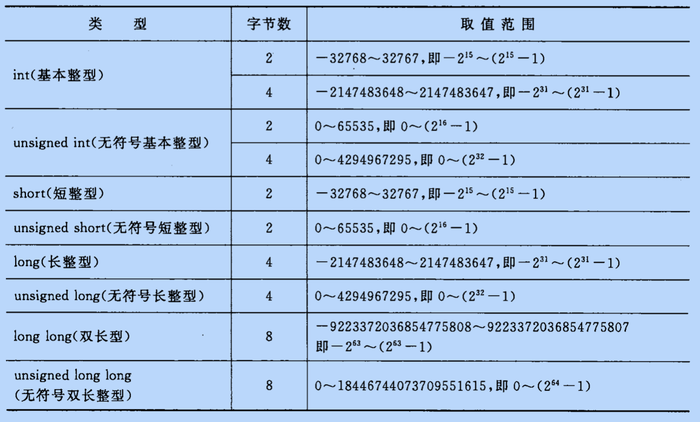
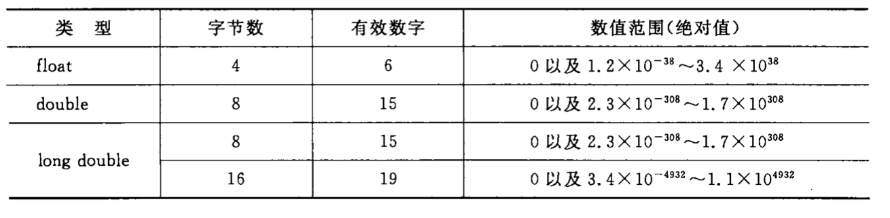
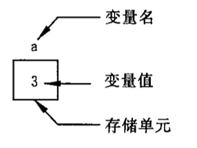
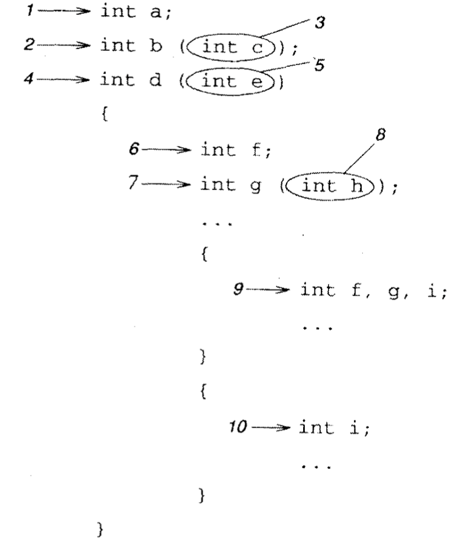
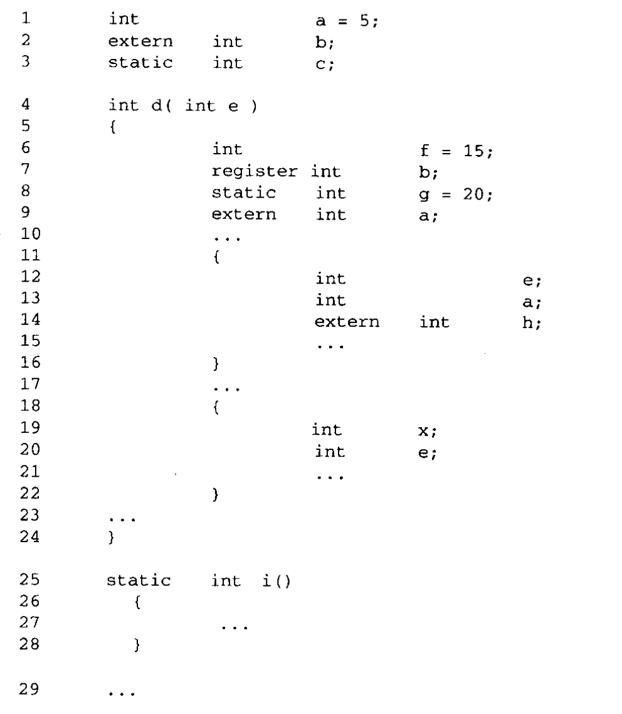

# 数据

## C 语言中的数据类型

### 基本数据类型

在 C 语言中仅有 4 种基本数据类型：整型、浮点型、指针和聚合类型（数组，结构体等）。所有其他类型都是从这 4 个基本类型派生而来的。

#### 整数类型

整型家族包括字符、短整型、整型和长整型，他们都分为有符号（signed）和无符号（unsigned）两种。规定整型值相互间的大小规则：`长整型至少应该和整型一样长，而整型至少应该和短整型一样长`。

**计算机中整数类型的存储和计算都是以补码形式。**


[原码、补码和反码](#原码、反码和补码)

- `int` 整型（基本整型）：编译系统分配给`int`2 或 4 个字节（具体由 C 编译系统自行决定）。`Turbo C 2.0`分配*2 个字节*，`Visual C++` 32 位系统下分配*4 个字节*。
- `short` 短整型：同上*2 个字节*
- `long` 长整型：同上*4 个字节*
- `unsigned short` 无符号短整型
- `unsigned int` 无符号整型
- `unsigned long` 无符号长整型
- `long long` 双长整型（C99）：8 字节
- `char` 字符型：字符是按其代码（整数）形式存储的，因此把字符型作为整数类型的一种。
- `bool` 布尔型（C99）



#### 浮点类型

浮点型数据是用来表示具有小数点的实数的。在 C 语言中，实数是以指数形式存放在存储单元中的。一个实数表示为指数可以有不止一种形式，如`3.1415926`可以表示为`0.31415926 * 10^1`、`0.031415926 * 10^2`，它们代表同一值。浮点数就是利用指数使小数点的位置可以根据需要而浮动，从而灵活的表达更大的范围。


C 语言中的小数可以使用指数形式来表示，即 `N = M * 10^E`。


在内存中，小数也是以指数形式来表示的，但又和 C 语言中的有所区别。小数在被存储到内存前，首先转换为下面的形式：`N = M * 2^E`，m 为尾数，是二进制形式。


- `float` 单精度浮点型
- `double` 双精度浮点型
- `float_complex`, `double_comple`, `long comple` 复数浮点型



### 空类型

- `void`

### 枚举类型

- `enum`

### 指针类型

指针就是地址。

### 派生类型

- `*` 指针类型
- `[]` 数组类型
- `struct` 结构体类型
- `union` 共用体类型
- 函数类型

其中基本类型和枚举型变量的值都是数值，统称为算数类型。算数类型和指针类型统称为纯量类型，因为其变量的值是数字来表示的。枚举类型是程序中用户定义的整数类型。数组类型和结构体类型统称为组合类型，共用体类型不属于组合类型，因为在同一时间内只有一个成员变量具有值。函数类型用来定义函数，描述一个函数的接口，包括函数返回值的数据类型和参数类型。

## 常量和变量

在计算机高级语言中，数据有两种表现形式：常量和变量。

### 常量

在程序运行过程中，其值不能被改变的量称为常量。

#### 字面值（字面量）

字面值（literal）这个术语是字面值常量的缩写，这是一种实体，指定了自身的值，并且不允许发生改变。

#### 整型常量

1000，123，-39 等我们常用的十进制整数。

0b010201 等二进制整数。

0123541 等八进制整数。

0x1233a 等十六进制整数。

#### 实型常量

1. 十进制小数形式。例如：3.1415926

2. 指数形式。例如：12.34e3 或者 12.34E3（代表 12.34 \* 10 ^ 3）

#### 字符常量

1. 普通字符。使用单引号引起来的单个字符，例如：'a'，'z'

2. 转义字符。一些特殊的字符形式：例如：'\n'，'\t'


#### 字符串常量

用双引号引起来的一个或若干个字符。例如："a"，"bcjd"。

#### 符号常量

用`#define`指令，指定一个符号名称代表一个常量。例如：`#define COUNT 100`。经过以上指定后在对程序进行编译前，预处理器先对`COUNT`进行处理，把所有的 COUNT 全部置换为`100`。这种用一个符号名代表一个常量的成为符号常量。

优点：

1. 含义清除

2. 一改全改

### 变量



变量代表一个有名字的、具有特定属性的一个存储单元。它用来存放数据，也就是存放变量的值。在程序运行期间，变量的值是可以改变的。

**变量必须先定义后使用**。在定义时指定该变量的名字和类型。一个变量应该有一个名字，以便被引用。变量名实际是以一个名字代表一个存储地址。在对程序编译连接时由编译系统给每一个变量名分配对应的内存地址。从变量中取值，实际上市通过变量名找到对应的内存地址，从该存储单元中读取数据。有时由于特殊情况要在变量定义以前使用，借助关键字 extern 声明变量。定义时，指定变量的名字和类型。定义变量时必须使用用户标识符，不能使用关键字。


```c
#include <stdio.h>
int main(int argc, const char * argv[]) {
    // 声明int a是外部定义变量
    extern int a;
    printf("Hello, World!  %d\n",a);
    return 0;
}
int a = 100;
```

### 常变量

```
const int a = 3;
```

表示 a 被定义为一个整型变量，指定其值为 3，而且在变量存在期间其值不能改变。

常变量与常量异同：常变量具有变量的基本属性，有类型，占存储单元，只是不允许改变其值。可以说，常变量是有名字的不变量，而常量是没有名字的不变量。有名字就便于在程序中被引用。

### 标识符

标识符是具有一定规则的字符，用来对变量、符号常量名、函数、数组、类型等命名。简单来说，标识符就是一个对象的名字。

命名规则：

- 以字母数字和下划线组成
- 首字母只能是字母或下划线
- 不能以系统关键字作为标识符
- 严格区分大小写
- 应做到见名知意

C 语言中的关键字：


- 类型：double, int, struct, long, enum, char, float, short, void，union
- 修饰：auto, register, extern, const, unsigned, signed, vloatile, static
- 分支：break, else, switch, case, if, default, goto
- 循环：do, for, while
- 功能：typedef, return, sizeof

C 语言的关键字在程序中都有特定的含义，不能另做他用。

---

## 运算符和表达式

C 语言的运算符范围很宽，把除了控制语句和输入输出以外的几乎所有的基本操作都作为运算符处理。

### 算数运算符


### 自增自减运算

- `++`
- `--`

```
++i，--i 在使用i前先将i的值+1/-1
i++，i-- 在使用i以后使i的值+1/-1

int a = 1;
int b = 2;

int n = (a++) + b;
// n = 3

int c = 1,d = 2;

int m = ++c + d;
// m = 4

```

> 自增自减运算符只能用于变量，而不能用于常量或表达式。

### 算数表达式和运算符的`优先级`和`结合性`

用算数运算符和括号将运算对象（也称操作数）连接起来、符合 C 语法规则的式子，成为**C 算数表达式**。运算对象包括常量、变量、函数等。

C 语言除了规定了运算符的`优先级`外，还规定了运算符的`结合性`。普通算数运算符的优先级顺序同数学运算顺序，先乘除后加减，括号内部作为整体运算。

如果在一个运算对象两侧的运算符的优先级相同，例如：`a-b+c`，则按规定的**结合方向**处理。C 语言规定了各运算符的结合方向（结合性），自左向右，即先左后右，因此`b`先于`-`结合，执行`a-b`的运算，然后再执行加`c`的运算。自左向右的结合方向又称`左结合性`。还有自右向左方向的运算，称为`右结合性`，例如：`=`运算符，`a = b = c`。

### 不同数据类型间的混合运算

不同数据类型间进行运算。

- 加减乘除运算中，运算符左右两边有一个数为 float 一个为 double。结果是 double 型，因为系统将所有 float 型数据都先转化为 double 型，然后进行运算。
- 如果 int 和 float 或 double 型数据进行运算，先把 int 和 float 转换为 double 然后进行运算，结果是 double 型。
- char 类型数据与整型数据进行运算，把字符的 ASCII 码与整型进行运算。如果 char 与浮点型进行运算，先将字符的 ASCII 码转换为 double 型数据再进行运算。

### 强制类型转换运算符

`(类型名)(表达式)`

```
(double)a 将a的值转为double类型
(int)(x + y) 将x+y的值转为int型
(float)(5%3) 将5%3的值转为float型
```

### 关系运算符

- `>` 大于
- `<` 小于
- `==` 等于
- `!=` 不等于
- `>=` 大于等于
- `<=` 小于等于

### 逻辑运算符

- `!` 非
- `&&` 且
- `||` 或

### 位运算符

- `>>`：右移运算，右移 n 位就是除以 2 的 n 次方。对于有符号数，在右移时，符号位将随同移动。当为正数时， 最高位补 0，而为负数时，符号位为 1，最高位是补 0 或是补 1 取决于编译系统的规定。
- `<<`：左移运算，丢弃最高位,0 补最低位。

  - 例：`a<<4 指把a的各二进位向左移动4位。如a=00000011(十进制3)，左移4位后为00110000(十进制48)。`

- `~`：取反，单目运算符，具有右结合性，对参与运算的数的各二进位按位求反。

  - 例：`~(1001) => 0110`

- `|`：按位或，两个数按照二进制进行按位比较，有 1 则为 1。
  

- `^`：按位异或，比较两个数，然后返回一个数，这个数的每个位设为 1 的条件是两个输入数的同一位不同，如果相同就设为 0
  

- `&`：按位与，两个数按照二进制进行按位比较，同 1 则为 1。
  

### 赋值运算符

- `=` 赋值
- `+=`：例：a += b 等价于 a = a + b
- `-=`：同上类似
- `*=`：同上类似
- `/=`：同上类似

### 条件运算符

- `?:` 三目运算，condition ? true_result : false_result

### 逗号运算符

- `,`

### 指针运算符

- `*`
- `&`

### 求字节数运算符

- `sizeof`

### 强制类型转换运算符

### 成员运算符

- `.`
- `->`

### 下标运算符

- `[]`

### 其他

- `()` 函数调用运算符

### 优先级


## 作用域

当变量在程序的某个部分被声明时，它只有在程序的一定区域才能被访问。这个区域由标识符的作用域（scope）决定。标识符的作用域就是程序中该标识符可以被使用的区域。

例如，函数的局部变量的作用域限于该函数的函数体。这个规则意味着两点：首先，其他函数都无法通过这些变量的名字访问它们，因为这些变量在它们的作用域之外便不再有效。其次，只要分属不同的作用域，你可以给不同的变量起同一个名字。

编译器可以确认 4 种不同类型的作用域：文件作用域，函数作用域，代码块作用域和原型作用域。标识符声明的位置决定它的作用域。



### 代码块作用域

位于一对花括号之间的所有语句称为一个代码块。任何在代码块的开始位置声明的标识符都具有代码块作用域，表示它们可以被这个代码块中所有语句访问。

6、7、9、10 的变量都具有`代码块作用域`。当代码块处于嵌套状态时，声明于内层代码块的标识符的作用域到达该代码块的尾部便告终止。然而，如果内层代码块有一个标识符的名字与外层代码块的一个标识符同名，内层的那个标识符就将隐藏外层的标识符，外层的那个标识符无法在内层代码块中通过名字访问。（9 的 f 和 6 的 f 是不同的变量，后者无法在内层代码中通过名字来访问）

不是嵌套的代码块中，声明与每个代码块的变量无法被另一个代码块访问，因为它们的作用域并无重叠之处。由于两个代码块的变量不可能同时存在，所以编译器可以把它们存储于同一个内存地址。例如，声明 10 的 i 可以和声明 9 的任何一个变量共享同一个内存地址。这种共享并不会带来任何危害，因为在任何时刻，两个非嵌套代码块最多只能有一个处于活动状态。

### 文件作用域

任何在所有代码块之外声明的标识符都具有`文件作用域`，它表示这些标识符从它们的声明之处直到它所在的源文件结尾处都是可以访问的。在文件中定义的函数名也具有文件作用域，因为函数名本身并不属于任何代码块。

> 在头文件中编写并通过`#include`指令包含到其他文件中的声明就好像它们是直接卸载那些文件中一样。它们的作用域并不限于头文件的文件尾。

### 原型作用域

`原型作用域`只适用于在函数原型中声明的参数名，如图中声明 3 和声明 8。在原型中（与函数的定义不同），参数的名字并非必需。但是，如果出现参数名，你可以随你所愿给它们取名字，它们不必与函数定义中的形参名匹配，也不必与函数实际调用时所传递的实参匹配。原型作用域防止这些参数名与程序其他部分的名字冲突。事实上，唯一可能出现冲突就是在同一个原型中，不止一次地使用同一个名字。

### 函数作用域

最后一种作用域的类型是函数作用域。它只适用于语句标签，语句标签用于 goto 语句，基本上，函数作用域可以简化为一条规则：一个函数中所用的语句标签必须唯一。

## 链接属性

当组成一个程序的各个源文件分别被编译后，所有的目标文件以及那些从一个或多个函数库中引用的函数链接在一起，形成可执行程序。然而，如果相同的标识符出现在几个不同的源文件中时，就会出现一些问题，它们是表示同一个实体还是不同的实体？

标识符的`链接属性`决定如何处理在不同文件中出现的标识符。标识符的作用域与它的链接属性有关，但这两个并不相同。

`链接属性`一共 3 种：`external（外部）`，`internal（内部）`，`none（无）`。没有链接属性的标识符（none）总是被当成单独的个体，也就是说该标识符的多个声明被当作独立不同的实体。属于`internal`链接属性的标识符在同一个源文件内的所有声明都指向同一个实体，但位于不同源文件的多个声明则分属不同的实体。`external`链接属性的标识符不论声明多少次，位于几个源文件都表示同一个实体。

关键字`extern`和`static`用于在声明中修改标识符的链接属性。如果某个声明在正常情况下具有`external`链接属性，在它前面加上`static`关键字可以使它的链接属性变为 internal。

例如：2 声明像这样写：`static int b;`

那么变量 b 就将为这个源文件所私有。在其他源文件中，如果也接到一个名叫 b 的变量，那么它所引用的是另一个完全不同的变量。类似，你也可以把函数声明为`static`，如下：`static int c(int d)`，这可以防止它被其他源文件调用。

`static`只对缺省链接属性为`external`的声明才有改变链接属性的效果。例如，尽管你可以在声明 5 前面加上`static`关键字，但它的效果完全不一样，因为 e 的缺省链接属性不是`external`。

`extern`关键字的规则更为复杂。一般而言，它为一个标识符指定`external`链接属性，这样就可以访问在其他任何位置定义的这个实体。

> 这两个关键字只有在声明中才是必需的，当用于具有文件作用域的声明时，这个关键字是可选的。然而，如果你在一个地方定义变量，并在使用这个变量的其他源文件的声明中添加 external 关键字，可以增加可读性。

当`extern`关键字用于源文件中一个标识符的第一次声明时，它指定该标识符具有 external 链接属性。但是，如果它用于该标识符第二次或以后的声明时，它并不会更改由第一次声明所指定的链接属性。

## 存储类型

变量的存储类型是指存储变量值的内存类型。变量的存储类型决定变量何时创建、何时销毁以及它的值将保持多久。有三个地方可以用于存储变量：普通内存、运行时堆栈、硬件寄存器。在这三个地方存储的变量具有不同的特性。

变量的缺省存储类型取决于它的声明位置。凡是在任何代码块之外声明的变量总是存储于静态内存中，也就是不属于堆栈的内存，这类变量称为静态变量。对于这类变量，无法为它们指定其他存储类型。静态变量在程序运行之前创建，在程序的整个执行期间始终存在。它始终保持原先的值，除非给它赋一个不同的值或者程序结束。

在代码块内部声明的变量的缺省存储类型是自动的，也就是说它存储于堆栈中，称为自动变量。有一个关键字`auto`就是用于修饰这种存储类型的，但它极少使用，因为代码块中的变量在缺省情况下就是自动变量。在程序执行到声明自动变量的代码块时，自动变量才被创建，当程序的执行流离开该代码块时，这些自动变量便自行销毁。如果该代码块被数次执行，这些自动变量每次都将重新创建。在代码块再次执行时，这些自动变量在堆栈中所占据的内存位置有可能和原先的位置相同，也可能不同。即使它们所占的位置相同，你也不能保证内存同时不会有其他用途。因此，我们可以说自动变量在代码块执行完毕后就消失。当代码块再次执行时，它们的值一般并不是上次执行时的值。

对于在代码块内部声明的变量，如果给它加上关键字 static,可以使它的存储类型从自动变为静态。具有静态存储类型的变量在整个程序执行过程中一直存在，而不仅仅在声明它的代码块的执行时存在。注意，修改变量的存储类型并不表示修改该变量的作用域，它仍然只能在该代码块内部按名字访问。函数的形式参数不能声明为静态，因为实参总是在堆栈中传递给函数，用于支持递归。

最后，关键字 register 可以用于自动变量的声明，提示它们应该存储于机器的硬件寄存器而不是内存中，这类变量称为寄存器变量。通常，寄存器变量比存储于内存的变量访问起来效率更高。但是，编译器并不一定要理睬 register 关键字，如果有太多的变量被声明为 register，它只选取前几个实际存储于寄存器中，其余的就按普通自动变量处理。如果一个编译器自己具有一套寄存器优化方法，它也可能忽略 register 关键字，其依据是由编译器决定哪些变量存储于寄存器中比人脑的决定更为合理一些。

在典型情况下，你希望把使用频率最高的那些变量声明为寄存器变量。在有些计算机中，如果把指针声明为寄存器变量，程序的效率将能得到提高，尤其是那些频繁执行间接访问操作的指针。你可以把函数的形式参数声明为寄存器变量，编译器会在函数的起始位置生成指令，把这些值从堆栈复制到寄存器中。但是完全有可能，这个优化措施所节省的时间和空间开销还抵不上复制的开销。

寄存器变量的创建和销毁时间和自动变量相同，但它需要一些额外的工作。在一个使用寄存器变量的函数返回之前，这些寄存器先前存储的值必须恢复，确保调用者的寄存器变量未被破坏。许多机器使用运行时堆栈来完成这个任务。当函数开始执行时，它把需要使用的所有寄存器的内容都保存到堆栈中，当函数返回时，这些值再复制会寄存器中。

在需对机器的硬件实现中，并不为寄存器指定地址。同样，由于寄存器值的保存和恢复，某个特定的寄存器在不同的时刻所保存的值不一定相同。

### 初始化

自动变量和静态变量的初始化存在一个重要的差别。在静态变量的初始化中，我们可以把可执行程序文件相要初始化的值放在程序执行时变量将会使用的位置。当可执行文件载入到内存时，这个已经保存了正确初始值的位置将赋值给那个变量。完成这个任务并不需要额外的时间，也不需要额外的指令，变量将会得到正确的值。如果不显示的指定其初始值，静态变量将初始化为 0。

自动变量初始化需要更多的开销，因为当程序链接时还无法判断自动变量的存储位置。事实上，函数的局部变量在函数的每次调用中可能占据不同的位置。基于这个理由，自动变量没有缺省的初始值，而显示的初始化将在代码块的起始处插入一条隐式的赋值语句。

这个技巧造成 4 中后果。首先，自动变量的初始化比较之赋值语句效率并无提高。除了声明为 const 的变量外，在声明变量的同时进行初始化和先声明后赋值只有风格之差，并无效率之别。其次这条隐式的赋值语句使自动变量在程序执行到它们所声明的函数或代码块时，每次都将重新初始化。这个行为与静态变量大不相同，后者只是在程序开始执行前初始化一次。第三个后果则是个优点，由于初始化在运行时执行，你可以使用任何表达式作为初始化值。

```c
int func ( int a ){
  int b = a + 3
}

```

除非你对自动变量进行显式初始化，否则当自动创建变量时，它们的值总是垃圾。

## static 关键字

当用于不同的上下文环境时，static 关键字具有不同的意思。

当它用于函数定义时，或用于代码块之外的变量声明时，static 关键字用于修改标识符的链接属性，从 external 改为 internal，但标识符的存储类型和作用域不受影响，用这种方式声明的函数或变量只能在声明它们的源文件中访问。

当它用于代码块内部的变量声明时，static 关键字用于修改变量的存储类型，从自动变量修改为静态变量，但变量的链接属性和作用域不受影响。用这种方式声明的变量在程序执行之前创建，并在程序执行期间一直存在，而不是每次在代码块形成时执行，在代码块执行完毕后销毁。

## 作用域、存储类型



上面的示例中，第1行的a的作用域为文件作用域，属于文件作用域的声明在缺省情况下为`external`链接属性。如果b定义在其他地方，`extern`关键字可以明确表示出来。第3行的static关键字修改了c的缺省链接属性，把它改为`internal`。声明了变量a和b的其他源文件在使用这两个变量时实际所访问的是声明于此处的这两个变量。但是，变量c只能由这个源文件访问，因为它具有`internal`链接属性。

变量a、b、c的存储类型为静态，表示它们并不是存储于堆栈中。因此，这些变量在程序执行之前创建，并一直保持它们的值，直到程序结束。当程序开始执行时，变量a将初始化为5。

这些变量的作用域一直延伸到这个源文件结束为止，但第7行和第13行声明的局部变量a和b在那部分程序中将隐藏同名的静态变量。因此，这3个变量的作用域为：

- a 第1至12行，第17至29行
- b 第2至6行，第25至29行
- c 第3至29行

第4行声明了2个标识符。d的作用域从第4行直到文件结束。函数d的定义对于这个源文件中任何以后想要调用它的函数而言起到了函数原型的作用。作为函数名，d在缺省情况下具有`external`链接属性，所以其他源文件只要在文件上存在d的原型，就可以调用d。如果我们将函数声明为static，就可以把它的链接属性从`external`改为`internal`，但这样做将使其他源文件不能访问这个函数。对于函数而言，存储类型并不是问题，因为代码总是存储于静态内存中。

参数e不具有链接属性，所以我们只能从函数内部通过名字访问它。它具有自动存储类型，所以它在函数被调用时被创建，当函数返回时消失。由于局部变量冲突，它的作用域限于第6行至11行，第17行至19行以及第23行到24行。

第6至8行声明局部变量，所以它们的作用域到函数结束为止。它们不具有链接属性，所以它们不能在函数的外部通过名字访问（这是它们称为局部变量的原因）。f的存储类型是自动，当函数每次被调用时，它通过隐式赋值被初始化为15。b的存储类型是寄存器类型，所以它的初始值是垃圾。g的存储类型是静态，所以它在程序的整个执行过程中一直存在。当程序开始执行时，它被初始化为20.当函数每次被调用时，他不会被重新初始化。

第9行的声明并不需要。这个代码块位于第1行声明的作用域之内。

第12行和13行为代码块声明局部变量。它们都具有`external`链接属性，存储于静态内存。这是唯一一个必须用`extern`关键字声明，如果没有它，h将变为一个局部变量。

第19和20行用于创建局部变量（自动、无链接属性、作用域限于本代码块）。这个e和参数e是不同的变量，它和第12行声明的e也是不同的。在这个代码块中，从第11行到第18行并无嵌套，所以编译器可以使用相同的内存来存储两个代码块中不同的变量e。如果你想让这两个代码块中的e表示同一个变量，那么你就不应该把它声明为局部变量。

最后，第25行声明了函数i，它具有静态链接属性。静态链接属性可以防止它被这个源文件之外的任何函数调用。事实上，其他的源文件也可能声明它自己的函数i，它与这个源文件的i是不同的函数。i的作用域从它声明的位置直达这个源文件结束。函数d不可以调用函数i，因为在d之前不存在i的原型。

具有`external`链接属性的实体在其他语言的术语里面称为全局（global）实体，所有源文件中的所有函数均可以访问它