# 数据

## 常量和变量

在计算机高级语言中，数据有两种表现形式：常量和变量。

### 常量

在程序运行过程中，其值不能被改变的量称为常量。常用的常量有以下几类：

#### 整型常量

1000，123，-39 等我们常用的十进制整数。

0b010201 等二进制整数。

0123541 等八进制整数。

0x1233a 等十六进制整数。

#### 实型常量

1. 十进制小数形式。例如：3.1415926

2. 指数形式。例如：12.34e3 或者 12.34E3（代表 12.34 \* 10 ^ 3）

#### 字符常量

1. 普通字符。使用单引号引起来的单个字符，例如：'a'，'z'

2. 转义字符。一些特殊的字符形式：例如：'\n'，'\t'

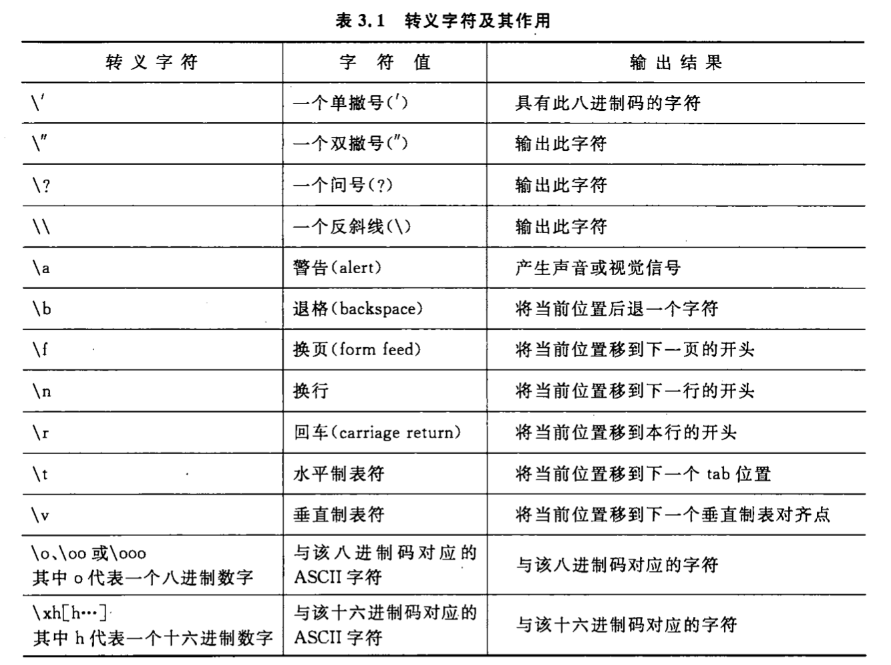

计算机处理的信息多种多样，例如文字，图像，声音等等，这些信息在人的眼里是完全不同的，但对于计算机来说，他们都是一样的，都用数表示，数据一般由 2 进制的数据流组成。

## 数

### 进制

- 十进制
- 八进制
- 二进制
- 十六进制

### 十进制整数转二进制

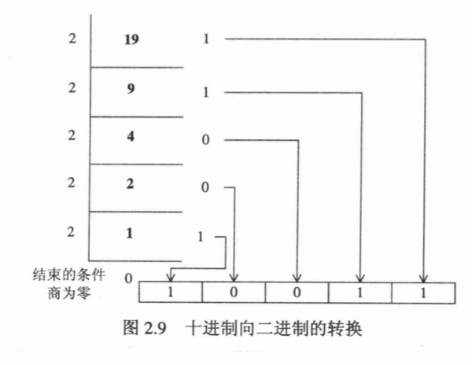

### 十进制小数转二进制

十进制小数转换成二进制小数采用"乘 2 取整，顺序排列"法。具体做法是：用 2 乘十进制小数，可以得到积，将积的整数部分取出，再用 2 乘余下的小数 部分，又得到一个积，再将积的整数部分取出，如此进行，直到积中的小数部分为零，或者达到所要求的精度为止。
然后把取出的整数部分按顺序排列起来，先取的整数作为二进制小数的高位有效位，后取的整数作为低位有效位。

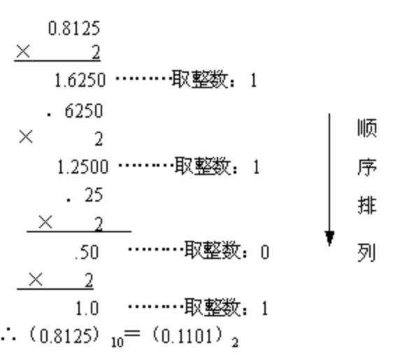

### 十进制转其他进制

同二进制，将运算数替换为对应进制即可

### 其他进制转十进制

从右到左用每位的数去乘以进制数的相应次方(个位为 0 次方),小数点后则是从左往右

```
例如：0b10101 = 1*2^0 + 0*2^1 + 1*2^2 + 0*2^3 + 1*2^4
```

### 其他进制转二进制

先转为十进制再转二进制

---

## 数据的描述

为了更方便的使用数据，增强程序的可读性，我们需要给数据进行归类，并指定一个名称。

### 标识符

标识符是具有一定规则的字符，用户用以更方便的调用数据，使用指令。

命名规则：

- 以字母数字和下划线组成
- 首字母只能是字母或下划线
- 不能以系统关键字作为标识符
- 严格区分大小写
- 应做到见名知意

C 语言中的关键字：

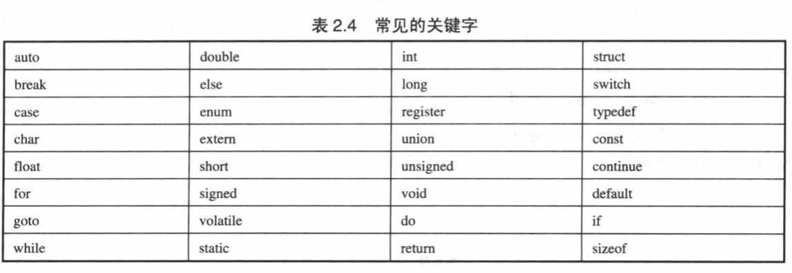

- 类型：double, int, struct, long, enum, char, float, short, void，union
- 修饰：auto, register, extern, const, unsigned, signed, vloatile, static
- 分支：break, else, switch, case, if, default, goto
- 循环：do, for, while
- 功能：typedef, return, sizeof

C 语言的关键字在程序中都有特定的含义，不能另做他用。

## C 语言中的数据类型

### 基本数据类型

#### 整数类型

**计算机中整数类型的存储和计算都是以补码形式。**

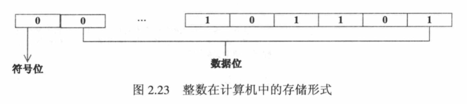

[原码、补码和反码](#原码、反码和补码)

- `int` 整型（基本整型）：编译系统分配给`int`2 或 4 个字节（具体由 C 编译系统自行决定）。`Turbo C 2.0`分配*2 个字节*，`Visual C++` 32 位系统下分配*4 个字节*。
- `short` 短整型：同上*2 个字节*
- `long` 长整型：同上*4 个字节*
- `usigned short` 无符号短整型
- `usigned int` 无符号整型
- `usigned long` 无符号长整型
- `long long` 双长整型（C99）：8 字节
- `char` 字符型：字符是按其代码（整数）形式存储的，因此把字符型作为整数类型的一种。
- `bool` 布尔型（C99）

#### 浮点类型

浮点型数据是用来表示具有小数点的实数的。在 C 语言中，实数是以指数形式存放在存储单元中的。一个实数表示为指数可以有不止一种形式，如`3.1415926`可以表示为`0.31415926 * 10^1`、`0.031415926 * 10^2`，它们代表同一值。浮点数就是利用指数使小数点的位置可以根据需要而浮动，从而灵活的表达更大的范围。

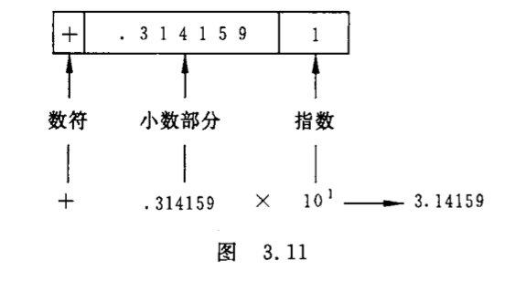

C 语言中的小数可以使用指数形式来表示，即 `N = M * 10^E`。

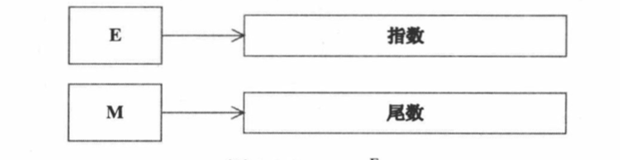

在内存中，小数也是以指数形式来表示的，但又和 C 语言中的有所区别。小数在被存储到内存前，首先转换为下面的形式：`N = M * 2^E`，m 为尾数，是二进制形式。

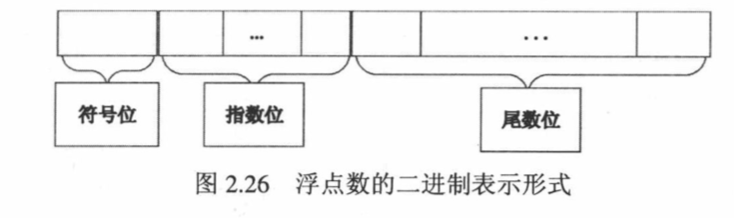

- `float` 单精度浮点型
- `double` 双精度浮点型
- `float_complex`, `double_comple`, `long comple` 复数浮点型

### 空类型

- `void`

### 枚举类型

- `enum`

### 派生类型

- `*` 指针类型
- `[]` 数组类型
- `struct` 结构体类型
- `union` 共用体类型
- 函数类型

其中基本类型和枚举型变量的值都是数值，统称为算数类型。算数类型和指针类型统称为纯量类型，因为其变量的值是数字来表示的。枚举类型是程序中用户定义的整数类型。数组类型和结构体类型统称为组合类型，共用体类型不属于组合类型，因为在同一时间内只有一个成员变量具有值。函数类型用来定义函数，描述一个函数的接口，包括函数返回值的数据类型和参数类型。

## 原码、反码和补码

### 机器数和真值

在学习原码, 反码和补码之前, 需要先了解机器数和真值的概念.

#### 机器数

一个数在计算机中的二进制表示形式, 叫做这个数的机器数。机器数是带符号的，在计算机用一个数的最高位存放符号, 正数为`0`, 负数为`1`.

比如，十进制中的数 `+3` ，计算机字长为 8 位，转换成二进制就是`00000011`。如果是 `-3` ，就是`10000011`。

那么，这里的`00000011`和`10000011`就是机器数。

#### 真值

因为第一位是符号位，所以机器数的形式值就不等于真正的数值。例如上面的有符号数`10000011`，其最高位 1 代表负，其真正数值是`-3`而不是形式值`131`（10000011 转换成十进制等于 131）。所以，为区别起见，将带符号位的机器数对应的真正数值称为机器数的真值。

```
例：
0000 0001的真值 = +000 0001 = +1
1000 0001的真值 = –000 0001 = –1
```

### 原码, 反码, 补码的基础概念和计算方法.

在探求为何机器要使用补码之前, 让我们先了解原码, 反码和补码的概念.对于一个数, 计算机要使用一定的编码方式进行存储. 原码, 反码, 补码是机器存储一个具体数字的编码方式.

#### 原码

原码就是符号位加上真值的绝对值, 即用第一位表示符号, 其余位表示值. 比如如果是 8 位二进制:

```
[+1]原 = 0000 0001
[-1]原 = 1000 0001
```

第一位是符号位. 因为第一位是符号位, 所以 8 位二进制数的取值范围就是:

[1111 1111 , 0111 1111]

即

[-127 , 127]

原码是人脑最容易理解和计算的表示方式.

#### 反码

反码的表示方法是:

- 正数的反码是其本身
- 负数的反码是在其原码的基础上, 符号位不变，其余各个位取反.

```
[+1] = [00000001]原 = [00000001]反
[-1] = [10000001]原 = [11111110]反
```

可见如果一个反码表示的是负数, 人脑无法直观的看出来它的数值. 通常要将其转换成原码再计算.

#### 补码

补码的表示方法是:

- 正数的补码就是其本身

负数的补码是在其原码的基础上, 符号位不变, 其余各位取反, 最后+1. (即在反码的基础上+1)

```
[+1] = [00000001]原 = [00000001]反 = [00000001]补
[-1] = [10000001]原 = [11111110]反 = [11111111]补
```

对于负数, 补码表示方式也是人脑无法直观看出其数值的. 通常也需要转换成原码在计算其数值.

### 为何要使用原码, 反码和补码

在开始深入学习前, 我的学习建议是先"死记硬背"上面的原码, 反码和补码的表示方式以及计算方法.

现在我们知道了计算机可以有三种编码方式表示一个数. 对于正数因为三种编码方式的结果都相同:

```
[+1] = [00000001]原 = [00000001]反 = [00000001]补
```

所以不需要过多解释. 但是对于负数:

```
[-1] = [10000001]原 = [11111110]反 = [11111111]补
```

可见原码, 反码和补码是完全不同的。既然原码才是被人脑直接识别并用于计算表示方式, 为何还会有反码和补码呢?

首先，因为人脑可以知道第一位是符号位，在计算的时候我们会根据符号位，选择对真值区域的加减。

但是对于计算机, 加减乘数已经是最基础的运算，要设计的尽量简单。计算机辨别"符号位"显然会让计算机的基础电路设计变得十分复杂! 于是人们想出了将符号位也参与运算的方法。

我们知道, 根据运算法则减去一个正数等于加上一个负数, 即: `1-1 = 1 + (-1) = 0`, 所以机器可以只有加法而没有减法, 这样计算机运算的设计就更简单了.

于是人们开始探索 将符号位参与运算, 并且只保留加法的方法. 首先来看原码:

计算十进制的表达式: `1-1=0`

```
1 - 1 = 1 + (-1) = [00000001]原 + [10000001]原 = [10000010]原 = -2
```

如果用原码表示。让符号位也参与计算, 显然对于减法来说，结果是不正确的。这也就是为何计算机内部不使用原码表示一个数。

为了解决原码做减法的问题，出现了反码：

计算十进制的表达式: `1-1=0`

```
1 - 1 = 1 + (-1) = [0000 0001]原 + [1000 0001]原= [0000 0001]反 + [1111 1110]反 = [1111 1111]反 = [1000 0000]原 = -0
```

发现用反码计算减法, 结果的真值部分是正确的. 而唯一的问题其实就出现在 0 这个特殊的数值上. 虽然人们理解上`+0`和`-0`是一样的, 但是`0`带符号是没有任何意义的. 而且会有`[0000 0000]原`和`[1000 0000]原`两个编码表示 0.

于是补码的出现, 解决了 0 的符号以及两个编码的问题:

```
1-1 = 1 + (-1) = [0000 0001]原 + [1000 0001]原 = [0000 0001]补 + [1111 1111]补 = [0000 0000]补=[0000 0000]原
```

这样 0 用`[0000 0000]`表示, 而以前出现问题的-0 则不存在了.而且可以用`[1000 0000]`表示`-128`：

```
(-1) + (-127) = [1000 0001]原 + [1111 1111]原 = [1111 1111]补 + [1000 0001]补 = [1000 0000]补
```

`-1-127`的结果应该是`-128`, 在用补码运算的结果中，`[1000 0000]补`就是`-128`。但是注意因为实际上是使用以前的-0 的补码来表示`-128`，所以`-128`并没有原码和反码表示。(对`-128`的补码表示`[1000 0000]补`算出来的原码是`[0000 0000]原`，这是不正确的)

使用补码, 不仅仅修复了 0 的符号以及存在两个编码的问题, 而且还能够多表示一个最低数. 这就是为什么 8 位二进制, 使用原码或反码表示的范围为`[-127, +127]`，而使用补码表示的范围为`[-128, 127]`。

因为机器使用补码，所以对于编程中常用到的 32 位`int`类型, 可以表示范围是：`[-231, 231-1]`因为第一位表示的是符号位。而使用补码表示时又可以多保存一个最小值。

## 运算符和表达式

C 语言的运算符范围很宽，把除了控制语句和输入输出以外的几乎所有的基本操作都作为运算符处理。

### 算数运算符

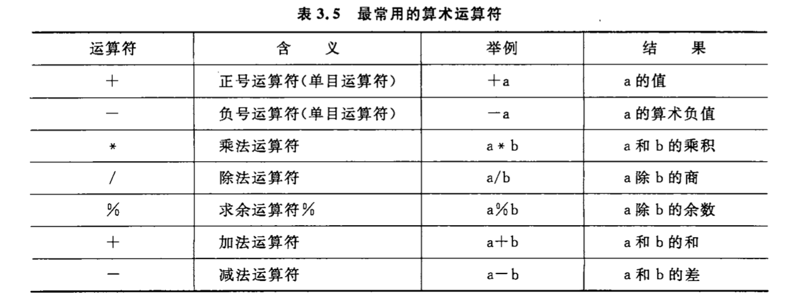

### 自增自减运算

- `++`
- `--`

```
++i，--i 在使用i前先将i的值+1/-1
i++，i-- 在使用i以后使i的值+1/-1

int a = 1;
int b = 2;

int n = (a++) + b;
// n = 3

int c = 1,d = 2;

int m = ++c + d;
// m = 4

```

> 自增自减运算符只能用于变量，而不能用于常量或表达式。

### 算数表达式和运算符的`优先级`和`结合性`

用算数运算符和括号将运算对象（也称操作数）连接起来、符合 C 语法规则的式子，成为**C 算数表达式**。运算对象包括常量、变量、函数等。

C 语言除了规定了运算符的`优先级`外，还规定了运算符的`结合性`。普通算数运算符的优先级顺序同数学运算顺序，先乘除后加减，括号内部作为整体运算。

如果在一个运算对象两侧的运算符的优先级相同，例如：`a-b+c`，则按规定的**结合方向**处理。C 语言规定了各运算符的结合方向（结合性），自左向右，即先左后右，因此`b`先于`-`结合，执行`a-b`的运算，然后再执行加`c`的运算。自左向右的结合方向又称`左结合性`。还有自右向左方向的运算，称为`右结合性`，例如：`=`运算符，`a = b = c`。

### 不同数据类型间的混合运算

不同数据类型间进行运算。

- 加减乘除运算中，运算符左右两边有一个数为 float 一个为 double。结果是 double 型，因为系统将所有 float 型数据都先转化为 double 型，然后进行运算。
- 如果 int 和 float 或 double 型数据进行运算，先把 int 和 float 转换为 double 然后进行运算，结果是 double 型。
- char 类型数据与整型数据进行运算，把字符的 ASCII 码与整型进行运算。如果 char 与浮点型进行运算，先将字符的 ASCII 码转换为 double 型数据再进行运算。

### 强制类型转换运算符

`(类型名)(表达式)`

```
(double)a 将a的值转为double类型
(int)(x + y) 将x+y的值转为int型
(float)(5%3) 将5%3的值转为float型
```

### 关系运算符

- `>` 大于
- `<` 小于
- `==` 等于
- `!=` 不等于
- `>=` 大于等于
- `<=` 小于等于

### 逻辑运算符

- `!` 非
- `&&` 且
- `||` 或

### 位运算符

- `>>`：右移运算，右移 n 位就是除以 2 的 n 次方。对于有符号数，在右移时，符号位将随同移动。当为正数时， 最高位补 0，而为负数时，符号位为 1，最高位是补 0 或是补 1 取决于编译系统的规定。
- `<<`：左移运算，丢弃最高位,0 补最低位。

  - 例：`a<<4 指把a的各二进位向左移动4位。如a=00000011(十进制3)，左移4位后为00110000(十进制48)。`

- `~`：取反，单目运算符，具有右结合性，对参与运算的数的各二进位按位求反。

  - 例：`~(1001) => 0110`

- `|`：按位或，两个数按照二进制进行按位比较，有 1 则为 1。
  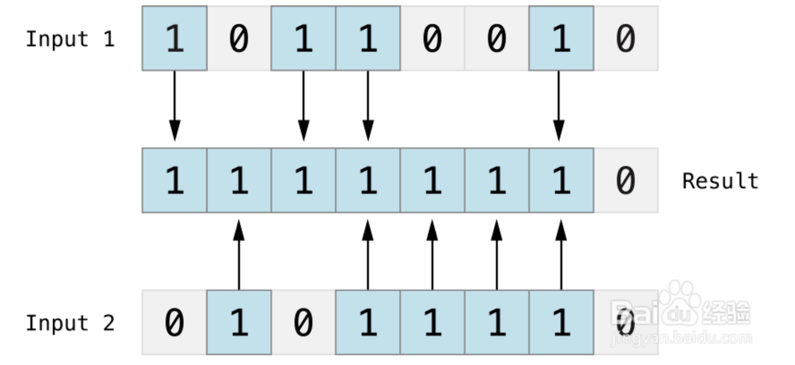

- `^`：按位异或，比较两个数，然后返回一个数，这个数的每个位设为 1 的条件是两个输入数的同一位不同，如果相同就设为 0
  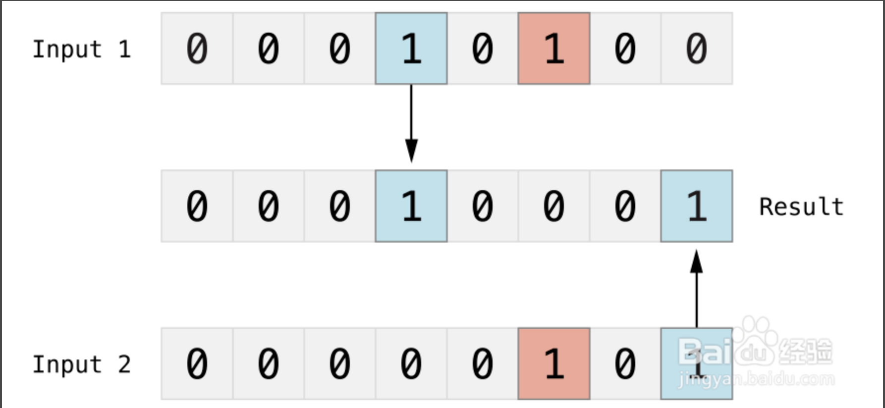

- `&`：按位与，两个数按照二进制进行按位比较，同 1 则为 1。
  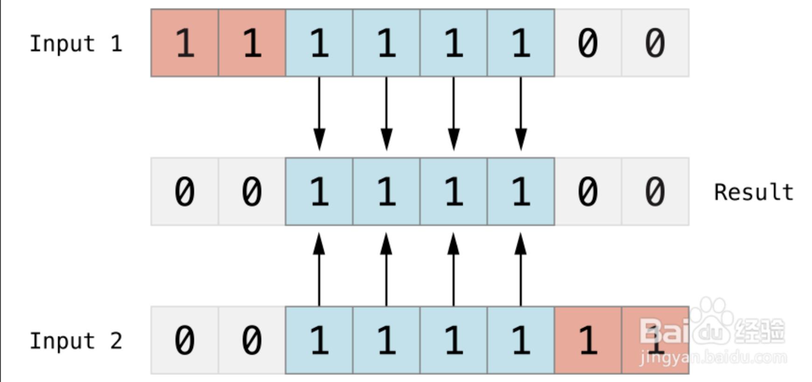

### 赋值运算符

- `=` 赋值
- `+=`：例：a += b 等价于 a = a + b
- `-=`：同上类似
- `*=`：同上类似
- `/=`：同上类似

### 条件运算符

- `?:` 三目运算，condition ? true_result : false_result

### 逗号运算符

- `,`

### 指针运算符

- `*`
- `&`

### 求字节数运算符

- `sizeof`

### 强制类型转换运算符

### 成员运算符

- `.`
- `->`

### 下标运算符

- `[]`

### 其他

- `()` 函数调用运算符

### 优先级

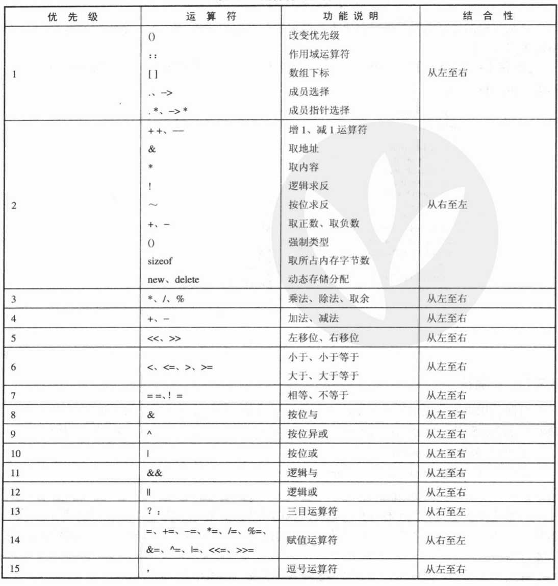

## 变量

变量代表一个有名字、具有特定属性的一个存储单元。用来存放变量的值。

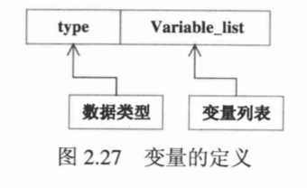

变量必须先定义，后使用（有时由于特殊情况要在变量定义以前使用，借助关键字 extern 声明变量）。定义时，指定变量的名字和类型。定义变量时必须使用用户标识符，不能使用关键字。

```c
#include <stdio.h>
int main(int argc, const char * argv[]) {
    // 声明int a是外部定义变量
    extern int a;
    printf("Hello, World!  %d\n",a);
    return 0;
}
int a = 100;
```

## 常量

### 字面量

- 整型常量：10，200 等整数

- 实型常量：3.14，2.5f 等浮点数

- 字符常量：‘a’

- 字符串常量：“abc”

- 符号常量：使用`#define`指定一个富豪命代表一个常量，例：`#define PI 3.14`，其中 PI 就是符号常量

### const

只读变量，即不能修改的变量，也就是常量。所以在定义时就需要进行赋值操作。

```
const int i = 50;
```
