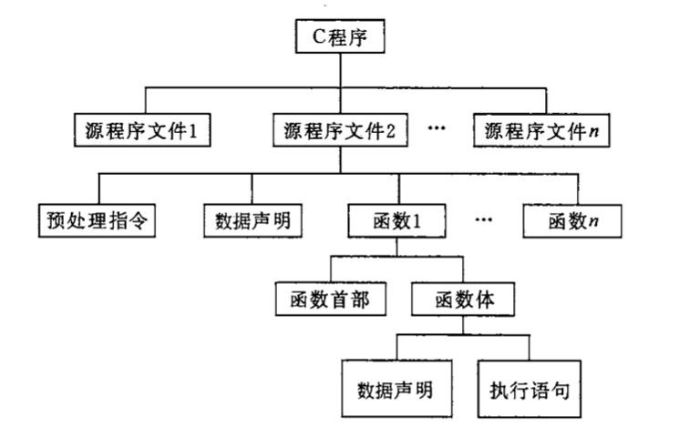
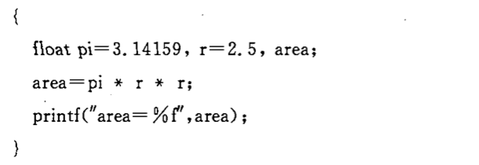

# 语句

一个函数包含**声明部分**和**执行部分**，程序执行的部分是由语句构成的，语句的作用是向计算机系统发出操作指令，要求执行相应的操作。程序的基本单位是语句。

## 分类

1. 控制语句：控制语句用于完成一定的控制功能。

- if()...else...
- for()
- while()
- do...while()
- continue
- break
- switch
- return
- goto

2. 函数调用语句：调用函数

3. 表达式语句：可分为算术表达式、赋值表达式、逗号表达式、关系表达式、逻辑表达式等...

4. 空语句

5. 复合语句

## 复合语句（语句块）

在程序开发中，我们经常将多条语句放入到一个{}中，多条语句组成了复合语句，也称为语句块。

## 作用域

变量起作用的区域,也就是说变量可以被访问到的区域。

### 局部变量

定义在一个确定的语句块里面的变量，作用域就是这个语句块。

### 全局变量

定义在所有语句块之外的变量，其作用域实在整个源程序。

## 控制结构

### 顺序结构

自上而下执行直到程序结束。

### 条件表达

根据某个条件是否满足来决定是否执行指定的操作

### 选择结构

从给定的两种或多种操作中选择其一执行。

### 循环结构

当满足某个条件就循环执行。