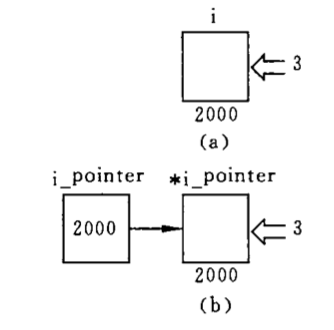

# 指针

## 数据在内存中的存储

如果程序中定义了一个变量，在对程序进行编译时，系统就会给这个变量分配内存单元。编译系统根据程序中定义的变量类型，分配一定长度的空间。

内存中每个字节都有一个编号，这就是内存“地址”。通过地址就能找到所需的变量单元，可以说**地址指向该变量单元**。因此，将地址形象化的成为**指针**，意思是通过它能找到以它为地址的内存单元。

程序中一般是通过变量名来引用变量的值。例如：`printf("%d",i)`，实际上，是通过变量名 i 找到储存单元的地址，从而对存储单元进行存取操作。程序经过编译以后已经将变量名转换为变量的地址，对变量值的存取都是通过地址进行的。

直接按变量名进行的访问，成为**直接访问**方式，还可以采用另一种称之为**间接访问**的方式，即将`变量i`的`地址`存放到另一变量中，然后通过该变量来找到变量 i 的地址，从而访问 i 变量。

我们可以定义整型、浮点型、字符型等变量，也可以定义一种特殊的变量，用它存放地址。

假设我们定义一个`i_pointer`用来存放整型变量的地址。可以通过`&`取地址符来获取变量`i`的地址。那么我们可以通过以下语句将`i`的地址存放到`i_pointer`中。`i_pointer`的值就是 2000（即变量 i 所占用单元的起始地址）。

```c
i_pointer = &i;
```


要存取变量 i 的值，既可以用直接访问的方式，也可以采用间接访问的方式：先找到存放“变量 i 地址”的变量`i_pointer`，从中取出 i 的地址（2000），然后到 2000 字节开始的存储单元中取出 i 的值。



（a）表示直接访问，根据变量名直接向变量 i 赋值，由于变量名与变量的地址有一一对应的关系，因此就按此地址直接对`变量i`进行访问。

（b）表示间接访问，先找到存放`变量i`地址的变量`i_pointer`，从其中得到变量 i 的地址（2000），从而找到变量 i 的存储单元，然后对它进行存取访问。

为了表示将数值 3 送到变量中，可以有两种表达方法：

（1）将 3 直接送到变量 i 所标志的单元中，例如：`i=3`

（2）将 3 送到`变量i_pointer`所指向的单元（即变量 i 的存储单元），例如：`*i_pointer = 3`，其中`*i_pointer`表示`i_pointer`指向的（对象）存储单元。

指向就是通过地址来体现的。假设`i_pointer`中的值是`变量i`的地址（2000），这样就在`i_pointer`和`变量i`之间建立起联系，即通过`i_pointer`能知道 i 的地址，从而找到变量 i 的内存单元。

由于通过地址能找到所需的变量单元，因此说，地址指向该变量单元。将地址形象化的成为**指针**。意思是通过它能找到以它为地址的内存单元。

一个变量的地址成为该变量的**指针**。例如，地址 2000 是变量 i 的指针。如果有一个变量专门用来存放另一变量的地址（即指针），则称它为`指针变量`。上述`i_pointer`就是一个`指针变量`。`指针变量`就是**地址变量**，用来存放地址，指针变量的值是**地址**（即指针）。

**指针**：代表存储单元在内存中的地址。

**指针变量**：存放指针（地址）的变量。

## 指针变量

类型名 \* 指针变量名

```
int *int_p; int类型的指针变量
```

指针变量名前的`*`表示

### 赋值与引用

赋值格式：`指针变量名 = &变量名`

获取或修改指针变量中的指针指向的内存单元的值：`*指针变量名`

```
// 声明一个int型的指针变量p
int *p;
// 声明并初始化一个int型变量a
int a = 10;
// 将a变量的地址存进p变量
p = &a;
// 修改指针变量p存储的地址的值
*p = 20;
```

> `&`取地址运算符。`&a`是变量 a 的地址

> `*`指针运算符（或“间接访问”运算符），`*p`代表指针变量 p 指向的对象。

### 指针与数组

一个变量有地址，一个数组包含若干个元素，每个数组元素都在内存中占用存储单元，它们都有相应的地址。指针变量既然可以指向变量，当然也可以指向数组元素。所谓数组元素的指针就是数组元素的地址。

```
int a[3] = {1,2,3};
int *p;
p = &a[0]; // p指向a数组的第0个元素；
```

引用数组可以用下标法（a[2]），也可以用指针法，即通过指向数组元素的指针找到所需元素。使用之阵发能是目标程序质量高（内存少，运行快）。

在 C 语言中，数组名（不包含形参数组名，形参数组并不占据实际的内存单元）代表数组中首个元素（索引为 0）的地址。

```
int a[10];
int *p;
p = &a[0];
或者：
p = a;
```

所以，`p = &a[0]` 等价于 `p = a`

初始化指针

```
int a[3] = {0,1,2};

int *p = &a[0];
等价于
int *p = a;

```

以上示例的作用是将 a 数组首元素的地址赋值给指针变量 p。

#### 指针的运算

在指针指向数组元素时，可以对指针进行以下运算：

- 加一个整数，例如：`p + 1`
- 减一个整数，例如：`p - 1`
- 自加运算，如`p++`，`++p`
- 自减运算，如`p--`，`--p`
- 两个指针相减，如`p1 - p2`（只有 p1 和 p2 都指向同一数组中的元素时才有意义）。

> 如果指针变量`p`指向数组中的一个元素，那么`p+1`指向同一数组中的下一个元素，`p-1`指向同一数组中的上一个元素。（执行 p+1 时并不是将 p 的值简单+1，而是加上一个数组元素所占用的字节数）


> 如果 p 的初始值为`&a[0]`，则`p+i`和`a+i`就是数组元素`a[i]`的地址，或者说，他们指向 a 数组序列号为 i 的元素。

`p + i`和`a + i`都代表`a[i]`的地址，都指向`a[i]`元素。

```
int a[10];
int *p;
p = &a[0];
p+i == &a[i]; /*语句成立*/
```

`*(p + i)`和`*(a + i)`是`p + i`或`a + i`指向的数组元素。

```
int a[10];
int *p;
p = &a[0];
*(p + i) == a[i]; /*语句成立*/
*(a + i) == a[i]; /*语句成立*/
```

指向数组的指针变量也可以带下标，如`p[i]`。

```
int a[10];
int *p;
p = &a[0];
p[i] == a[i]; /*语句成立*/
```

> 如果指针变量 p1 和 p2 都指向同一数组，如执行`p2-p1`，结果是`p2-p1`的值（两个地址之差）除以数组元素的长度。

> 两个地址不能相加，p1 + p2 是无实际意义的

#### 通过指针引用数组元素

1. 下标法：数组元素用数组名和下标表示

```
#include <stdio.h>

int main(){
  int a[10];
  int i;
  for (i = 0; i < 10; i++){
    scanf("%d",&a[i]);
  }
  for (i = 0; i < 10; i++){
    printf("%d",a[i]);
  }
  return 0;
}

```

2. 指针法：通过数组名计算数组元素地址，找出元素的值

```
#include <stdio.h>

int main(){
  int a[10];
  int i;
   for (i = 0; i < 10; i++){
    scanf("%d",&a[i]);
  }
  for (i = 0; i < 10; i++){
    printf("%d",*(a + i));
  }
  return 0;
}

```

3. 用指针变量指向数组元素

```
#include <stdio.h>

int main(){
  int a[10];
  int *p;
  int i;
  p = &a[0];
  for(i = 0; i< 10; i++){
    scanf("%d",&a[i]);
  }
  for(i = 0; i < 0; i++){
    printf("%d",*(p + i));
  }
  return 0;
}

```

#### 数组名作为函数参数

在数组中，通常将数组元素作为函数的参数，也可以将数组名作为函数的参数。

```
#include <stdio.h>

int main(){

  int a[10];
  // 数组名作为函数的实参，代表数组首元素的地址，因此传递的是地址,是一个固定值
  f(a,10);
  return 0;
}

// 数组名作为形参（int arr[]），用来接受从实参传递过来的数组首元素地址，在函数执行期间，他可以被再次赋值
void f(int arr[],int n){

  // 再次赋值
  arr = arr + 3;

}

```

> C 语言规定，数组名代表数组首元素地址。数组名本来就是一个地址的引用，直接相当于`指针变量`


#### 二维数组和指针

指针变量可以指向一维数组中的元素，也可以指向多维数组中的元素。但在概念上和使用方法上，多为数组的指针比一维数组的指针要复杂一些。

定义一个数组`a[3][4]`，它有 3 行 4 列；它由 3 个一维数组组成，可以看做是“数组的数组”。

```
a   _ > a[0][0] a[0][1] a[0][2] a[0][3] __ 2000
a+1 _ > a[1][0] a[1][1] a[1][2] a[1][3] __ 2000 + 4*4
a+2 _ > a[2][0] a[2][1] a[2][2] a[2][3] __ 2000 + 2*4*4
```

从二维数组角度来看，a 代表二维数组首元素的地址，现在的首元素不是一个简单的整型元素，而是由 4 个整型元素所组成的一维数组，因此 a 代表的是首行（即序列号为 0）的首地址。a + 1 代表序号为 1 的行的首地址。如果二维数组的首行地址是 2000，一个整型数据占 4 个字节，则 a+1 的值应该是`2000 + 4 * 4 = 2016`。a+1 指向`a[1]`，或者说，a+1 的值是 a[1]的首地址。

a[0]，a[1]，a[2]既然是一维数组名，而 C 语言又规定了数组名代表数组首元素地址，因此`a[0]`代表一维数组 a[0]中第 0 列元素的地址，即`&a[0][0]`，同理`a[1] == &a[1][0]`，`a[2] == &a[2][0]`。

```
a == &a[0]
a[0] == &a[0][0]
*(a + 0) = a[0]
*(*(a + 0) + 0) = a[0][0]

*(a+1) = a[1]
*(*(a + 1) + 0) = a[1][0]
*(*(a + 1) + 1) = a[1][1]

```

### 指针与字符串

C 语言中字符串是在一对双引号中包含若干个合法字符。例如：`"abc"`。我们也可以使用字符指针指向一个字符串来进行使用，即通过指针引用字符串。

#### 字符串的引用

C语言不存在字符串类型，但是C语言提供了`字符串常量`。事实上，C语言存在字符串的概念：它就是一串以NUL字节结尾的0个或多个字符。字符串通常存储在字符数组中，这也是C语言没有显示的字符串类型的原因。

我们之所以把字符串常量和指针经常放到一起，因为在程序中使用字符串常量会生成一个“**指向字符的常量指针**”。当一个字符串常量出现于一个表达式中时，表达式所使用的值就是这些字符所存储的地址，而不是这些字符本身。因此，你可以把字符串常量赋值给一个“**指向字符的指针**”，但是不能把字符串常量赋值给一个字符数组，因为字符串常量的直接值是一个指针，而不是这些字符本身。

> 标准C函数库包含了一组函数，用于操纵字符串，包括对字符串进行复制、连接、比较以及计算字符串长度和在字符串中查找特定字符的函数。

1. 用字符数组存放一个字符串，可以通过数组名和下标引用字符串中一个字符，也可以通过数组名和格式声明“%s”输出该字符串。

```
char str[] = "abcf";
printf("%s",str);
char c = str[0];
```

2. 用字符串指针指向一个字符串常量，通过字符指针变量引用字符串常量。


```
char *str = "123456";
printf("%s",str);
```

> 分析：除了使用 `char str[] = "abcf";`的方式定义字符数组，我们也可以使用指针来引用字符串常量。C 语言对字符串常量是按字符数组处理的，在内存中开辟了一个字符数组用来存放该字符串常量，但是这个字符数组是没有名字的，因此不能通过数组名来引用，只能通过指针变量来引用。C 语言中只有字符变量，没有字符串变量。对字符指针变量的初始化，实际上市吧字符串第一个元素的地址赋值给指针变量`str`。


#### 字符串指针做参数

```
void pStr(char *str){
    printf("%s \n",str);
}

void pStrArr(char *str[], int n){

    for (int i = 0; i < n; i++) {

    }

}


int main(int argc, const char * argv[]) {
    // insert code here...

    pStr("asdjkldjklas");

    char *strArr[] = {"abc","cad"};

    pStrArr(strArr, 2);

    return 0;
}

```

### 函数指针

**函数的首地址**：C 语言规定，一个函数总是占用一段连续的内存区，而函数名就是该函数所占内存区的首地址。

**函数指针变量**：指向函数的指针变量，就是函数的首地址复制给这个指针变量。

**定义**：`类型标识 (*函数指针变量名)(参数类型，参数类型...)`。

如果在程序中定义一个函数，在编译时，编译系统为函数代码分配一段存储空间，这段存储空间的起始地址成为这个函数的指针。

因此，可以定义一个指向函数的指针变量，用来存放某一函数的起始地址，这就意味着此指针变量指向该函数。

```
int addNum(int a, int b){
  return a + b;
}
int *p(int,int);
p = addNum;
(*p)(10,10);
```

> 注意：
>
> 1. 定义指向函数的指针变量，并不意味着这个指针变量可以指向任何函数，它只能指向在定义时指定的类型的函数。在一个程序中一个指针变量可以先后指向同类型不同的函数。
> 2. 如果要用指针调用函数，必须先使指针变量指向该函数。如`p = addNum`，这就把 addNum 的函数入口地址赋给了指针变量 p。
> 3. 再给函数指针变量赋值时，只需给出函数名而不必给出参数。
> 4. 用函数指针变量调用函数时，只需将（*p）代替函数名即可，例如：`(*p)(10,10);`
> 5. 对指向函数的指针变量不能进行算数运算。
> 6. 用函数名调用函数，只能调用所指定的一个函数，而通过指针变量调用函数比较灵活，可以根据不同情况先后调用不同函数。

#### 使用函数指针作为参数

```
void f(int (*p1)(int)){

}

int test(int n){
  return 2 * n;
}

int main(){

  f(test);

  return 0;
}

```

### 指针函数

函数的返回值是指针类型的数据，即地址。

**格式**：`函数类型 * 函数名（形参）`

### 指针数组和多重指针

一个数组，若其元素均为指针类型数据，称为指针数组，也就是说，指针数组中的每一个元素都存放一个地址，相当于一个指针变量。

定义一个指针数组：`int *p[4]`。

定义一维指针数组的一般形式：`类型名 * 数组名[数组长度]`

指针数组比较适合用来指向若干个字符串，是字符串的处理更加灵活。


#### 指向指针数据的指针


从图中看到，name 是一个指针数组，它的每一个元素是一个指针型的变量，其值为地址。name 既然是一个数组，它的每一个元素都有相应的地址。数组名 name 代表该指针数组首元素的地址。name + i 是 name[i] 的地址。name + i 就是指向指针型数据的指针。还可以设置一个指针变量 p，它指向指针数组的元素。p 就是指向指针型数据的指针变量。

```
char **p; // 代表p指向一个char类型的指针

p -> &p -> char
```

p 前面有两个`*`号。即：char * (*p)，代表`p`是一个指向字符变量的指针变量，那么`*p`也就是一个指向[字符变量的指针变量]的指针变量。


### 动态内存分配

全局变量分配在内存中的静态存储区，非静态的局部变量（包括形参）是分配在内存中的动态存储区的，这个存储区是一个成为栈（stack）的区域。除此以外，C 语言还允许建立内存动态分配区域，以存放一些临时用的数据，这些数据不必再程序的声明部分定义，也不必等到函数结束时才释放，而是需要随时开辟，不需要时随时释放。这些数据是临时存放在一个特别的自由存储区，成为堆（heap）区。可以根据需要，向系统申请所需大小的空间。由于未在声明部分定义他们为变量或数组，因此不能通过变量名或数组名去引用这些数据，只能通过指针来引用。

#### 建立内存的动态分配

对内存的动态分配是通过系统提供的库函数来实现的，主要有`malloc`、`calloc`、`free`、`realloc`这 4 个函数。

**1. 使用 malloc 函数**

其函数原型为：`void * malloc(unsigned int size)`;

作用是在内存的动态存储区中分配一个长度为 size 的连续空间。形参 size 的类型定为无符号整型（不允许为负数）。此函数的值（即“返回值”）是所分配区域的第一个字节的地址，或者说，此函数是一个指针型函数，返回的指针指向该分配区域的开头位置。

```
malloc(100); // 开辟100字节的临时分配域，函数值为其第1个字节的地址
```

指针的类型为 void，即不指向任何类型的数据，只提供一个地址。如果此函数未能成功执行（例如内存空间不足），则返回空指针（NULL）。

**2. 使用 calloc 函数**

其函数原型为：`void * calloc(unsigned n, unsigned size);`

作用是在内存的动态存储区中分配 n 个长度为 size 的连续空间，这个空间一般比较大，足以保存一个数组。

用 calloc 函数可以为一维数组开辟动态存储空间，n 为数组元素个数，每个元素长度为 size。这就是动态数组。函数返回指向所分配域的起始位置的指针；如果分配不成功，返回 NULL。

```
p = calloc(50,4); // 开辟50 * 4个字节的临时分配域，把起始地址赋值给指针变量p
```

**3. 使用 free 函数**

其函数原型为：`void free(void *p);`

作用是释放指针变量 p 所指向的动态空间，是这部分空间能重新被其他变量使用。p 是最近一次调用 calloc 或 malloc 函数时得到的函数返回值。

```
free(p); // 释放指针变量p所指向的已分配的动态空间
```

free 函数无返回值。

**4. 使用 realloc**

其函数原型为：`void *realloc(void *p,unsigned int size);`

如果已通过 malloc 函数或 calloc 函数获得了动态空间，想改变其大小，可以用`realloc`函数重新分配。

用 realloc 函数将 p 所指向的动态空间大小改变为 size。p 的值不变。如果重分配不成功，返回 NULL。

```
realloc(p,50); // 将p所指向的已分配的动态空间改为50字节
```

以上 4 个函数的声明在 stdlib.h 头文件中，在用到这些函数时应当用`#include <stdlib.h>`指令吧 stdlib.h 头文件包含到程序文件中。

#### void 指针类型

指向空类型或不确定类型的数据。在将它的值赋给另一指针变量时由系统对它进行类型转换，使之适合于被赋值的变量的类型。

```
int a = 3;
int *p1 = &a;
char *p2;
void *p3;
p3 = (void *)p1;
p2 = (char *)p3;
printf("%d",*p1);
p3 = &a;
printf("%d", *p3);
```

> 当把 void 指针赋值给不同基类型的指针变量（或相反）时，编译系统会自动进行转换，不必用户自己进行强制转换。

---

> (1)首先要准确地弄清楚指针的含义。指针就是地址，凡是出现“指针”的地方，都可以用“地址”代替，例如，变量的指针就是变量的地址，指针变量就是地址变量。
>
> 要区别指针和指针变量。指针就是地址本身，而指针变量是用来存放地址的变量。指针变量的值就是一个**地址**。
>
> (2)什么叫**指向**。地址就意味着指向，因为通过地址能找到具有该地址的对象。对于指针变量来说，把谁的地址存放在指针变量中，就说此指针变量指向谁。但应该注意：并不是任何类型数据的地址都可以存放在同一个指针变量中的，只有与指针变量的基类型相同的数据的地址才能存放在相应的指针变量中。
>
> 既然许多数据对象（如变量、数组、字符串和函数）都在内存中被分配存储空间，就有了地址，也就有了指针。可以定义一些指针变量，存放这些数据对象的地址，即指向这些对象。
>
> `void *`指针是一种特殊的指针，不指向任何类型的数据，如果需要用此地址指向某类型的数据，应先对地址进行类型转换。可以在程序中进行显式的类型转换，也可以由编译系统进行隐式转换。
>
> (3)要深入掌握在对数组的操作中正确地使用指针，搞清楚指针的指向。一维数组名代表数组首元素的地址，如：

```
int *p,a[10];
p = a;
```

> p 指向 int 型类型的指针变量，显然，p 只能指向数组中的元素（int 型变量），而不是指向整个数组。在进行赋值时一定要先确定赋值号两侧的类型是否相同，是否允许赋值。
>
> 对`p = a`，准确地说应该是：p 指向 a 数组的首元素，在不引起误解的情况下，有时也简称为：p 指向 a 数组。同理，p 指向字符串，也应该理解为 p 指向字符串中的首字符。
>
> (4)有关指针变量的归纳比较：
>  
>
> (5)指针运算
>
> ① 指针变量加/减一个整数：是将该指针变量的原值（地址）和它指向的变量所占用的存储单元的字节数相加/减。

```
p++;
p--;
p+i;
p-i;
p+=i;
p-=i;
```

> ② 指针变量赋值：将一个变量首地址赋给一个指针变量。

```
p = &a; // 将变量a的地址赋给p
p = array; // 将数组array首元素地址赋给p
p = &array[i]; // 将数组array第i个元素的地址赋给p
p = max; // max为已定义的函数，将max的入口地址赋给p
p1 = p2; // p1和p2是基类型相同指针变量，将p2的值赋给p1
```

> ③ 两个指针变量可以相减：如果两个指针变量都指向同一个数组中的元素，则两个指针变量值之差是两个指针之间的元素个数。
>
> ④ 两个指针变量比较：若两个指针指向同一数组的元素，则可以进行比较。指向前面的元素指针将`小于`指向后面元素的指针变量。
>
> 
>
> (6) 指针变量可以有空值，即该指针变量不指向任何变量，可以这样表示：`p = NULL`，其中`NULL`是一个符号常量，代表整数 0。在 stdio.h 头文件中对 NULL 进行了定义：`#define NULL 0`，它使 p 指向地址为 0 的单元。系统保证使该单元不作他用（不存放有效数据）。
>
> 应该注意，p 的值为 NULL 与未对 p 赋值时两个不同的概念。前者是有值的（值为 0），不指向任何变量，后者虽未对 p 赋值，但并不等于 p 无值，只是它的值是一个无法预料的值，也就是 p 可能指向一个事先未指定的单元。这种情况是很危险的。因此，在引用指针变量之前应该对它赋值。
>
> 任何指针变量都可以与 NULL 进行相等或不等的比较

```
if (p == NULL){}
```
