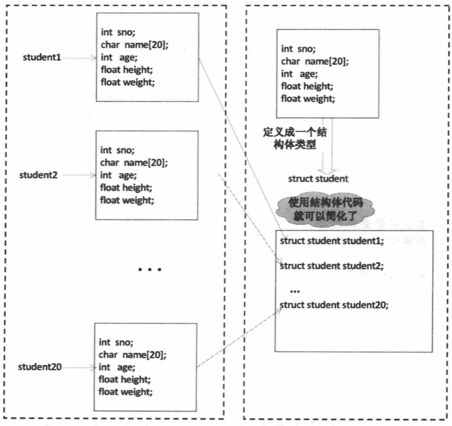
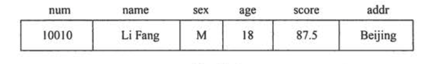
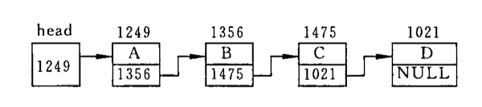
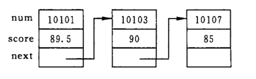

# 结构体

结构体是由一系列具有相同类型或不同类型的数据构成的数据的集合，也叫结构体。它是 C 语言提供给用户自定义的组合型数据结构。



一般形式：`struct 结构体名 {成员列表};`,声明结构体类型

声明并定义：`struct 结构体名 {成员列表} 变量名列表;`，声明结构体并定义变量

匿名形式：`struct {成员列表} 变量名列表;`，匿名类型并定义结构体变量

```
struct student {
  char *name;
  int age;
  float height;
  float weight;
}
```

## 为什么要使用结构体

我们所用的变量大多数是相互独立、无内在联系的。例如定义了整型变量 a、b、c，它们都是单独存在的变量，在内存中的地址也是互不相干的，但在实际生活和工作中，有些数据是有内在联系的，成组出现的。例如，一个学生的学号，姓名，年龄，成绩等，是属于同一个学生的。



如果将 num、name、sex、age、score、addr 分别定义为相互独立的简单变量，难以反映它们之间的内在联系。人们希望把这些数据组成一个组合数据，例如定义一个 student_1 的变量，在这个变量中包括学生 1 的学号，姓名，性别，成绩，地址等信息。这些信息并不能用同一种类型来表示，所以也无法用数组来存储，并且数组也无法反映出它们各自代表的意义。所以我们需要一种数据结构来让用户自己定义，这就用到了结构体。

```
struct Student {
  int num;
  char *name;
  int sex;
  int age;
  float score;
  char *addr;
};
```

## 定义结构体类型变量

1. 先声明结构体类型，在定义该类型的变量

```
struct Student   std1,std2;
--------------   ---------
结构体类型名      结构体变量名
```

在定义了结构体变量后，系统会为之分配内存单元。

2. 在声明类型的同时定义变量

```
struct Student {
  int num;
  char *name;
  int sex;
  int age;
  float score;
  char *addr;
} std1,std2;
```

声明类型和定义变量放在一起进行，能直接看到结构体的结构，比较直观。

## 结构体变量的初始化和引用

在定义结构体变量时，可以对它初始化，即赋予初始值。然后可以引用这个变量，例如输出它的成员的值。

```
int main(){
  struct Person {
    int num;
    char *name;
  }p1 = {1000,"zh"};

  printf("%d",p1.num);

}
```

> 程序中声明了一个结构体名为 Person 的结构体类型，有 2 个成员。在声明类型的同事定义了结构体变量 p1，这个变量具有 struct Person 类型所规定的结构。在定义变量同时，进行初始化。
> 在定义结构体变量时可对它到的成员变量初始化。初始化列表是用花括号括起来的一些常量，这些常量一次赋给结构体变量中的各成员。

> C99 标准允许对某一成员初始化，例如：`struct Person p = {.num=1000}`。

> 可以引用结构体变量中的成员的值，格式为：`结构体变量名.成员名`

> 如果成员本身有属于一个结构体，则要用若干个成员运算符：`结构体变量名.成员名.成员名`

> 结构体变量可以像普通变量一样进行各种运算。

> 同类的结构体变量可以互相赋值。

```
struct Person p1 = {100,"XH"};
struct Person p2 = {20,"ZXH"};
p1 = p2;
```

> 可以引用结构体变量成员的地址，也可以引用结构体变量的地址：`&p1; &p1.num`

## 结构体数组

定义结构体数组：

- 方式 1：`{成员列表} 数组名[数组长度]`

```
struct Stu {

} stds[3];
```

- 方式 2：`结构体类型 数组名[数组长度]`

```
struct Stu {

};
struct Stu stds[10];
```

对结构体数组初始化：`={初值列表}`

```
struct Person people[3] = {30,"p1",20,"p2",25,"p3"};
或者
struct Person people[3] = {{30,"p1"},{20,"p2"},{25,"p3"}};
```

## 结构体指针

所谓结构体指针就是指向结构体的指针。

指向结构体对象的指针变量，既可以指向结构体变量，也可指向结构体数组中的元素。指针变量的基类型必须与结构体变量的类型相同。

### 用结构体变量和结构体变量指针作为函数参数

将一个结构体的值传给一个函数，有 3 种方法：

1. 用结构体变量的成员作为实参。将实参的值传递给形参。用法和普通变量作实参是一样的。属于“值传递”的方式。

2. 用结构体实体作为实参，用结构体变量作为实参时，采取的也是“值传递”的方式，将结构体变量所占的内存单元的内容分全部按顺序传递给形参，形参也必须是同类型的结构体变量。在函数调用期间形参也要占用内存单元。这种传递方式在空间和时间上开销较大，如果结构体的规模很大时，开销是很可观的。

3. 用结构体变量的指针作为实参，将结构体变量的地址传给形参。

## 链表

### 什么是链表

链表是一种常见的重要的数据结构。它是动态地进行存储分配的一种结构。在用数组存放数据时，必须事先定义固定的数组长度。如果有的班级有 100 人，而有的班级只有 30 人，若用同一个数组先后存放不同班级的学生数据，则必须定义长度为 100 的数组。如果事先难以确定一个班的最多认输，则必须把数组定得足够大，以便能存放任何班级的学生数据，显然这将会浪费内存。链表则没有这种缺点，它根据需要开辟的内存单元。



链表有一个“头指针”变量，它存放一个地址，该地址指向一个元素。链表中每一个元素成为结点，每个结点都应包括两个部分：（1）用户需要用的实际数据；（2）下一个结点的地址。链表中 head 指向第一个元素，第一个元素又指向第二个元素...直到最后一个元素，该元素不再指向其他元素，它称为“表尾”，它的地址部分放一个"NULL",链表到此结束。

可以看到链表中各个元素在内存中的地址是可以不连续的。要找某一个元素，必须找到上一个元素，根据它提供的下一个元素地址才能找到下一个元素。如果不提供“头指针”，则整个链表都无法访问。链表如同一条铁链一般，一环扣一环，中间是不能断开的。

显然，链表这种数据结构，必须利用指针变量才能实现，即一个结点中应该包含一个指针变量，用它存放下一个结点的地址。

用结构体去建立链表是最合适的。一个结构体变量包含若干个成员，这些成员可以是数值类型、字符类型、数组类型、也可以是指针类型。用指针类型成员来存放下一个结点地址。例如：

```
struct Student {
  int num;
  float score;
  struct Student *next;
}
```



### 建立简单的静态链表

所有结点都是在程序中定义的，不是临时开辟的，也不能用完以后释放，这种链表称为“静态链表”。

```
#include <stdio.h>

struct Student {
    int num;
    float score;
    struct Student *next;
};


int main(int argc, const char * argv[]) {
    // insert code here...
    printf("Begin !\n");
    
    struct Student a,b,c,*head,*p;
    
    head = &a;
    a.num = 1;
    a.score = 98.0;
    a.next = &b;
    
    b.num = 2;
    b.score = 95.0;
    b.next = &c;
    
    c.num = 3;
    c.score = 90.0;
    c.next = NULL;
    
    p = head;
    
    do {
        printf("num:%d \n",p->num);
        printf("score:%f \n",p->score);
        p = p->next;
        printf("------------------------ \n");
    } while (p != NULL);
    
    printf("END! \n");
    return 0;
}
```

### 建立动态链表

所谓建立动态链表是指在程序执行过程中从无到有地建立起一个链表，即一个一个地开辟结点和输入各结点和输入各结点数据，并建立起前后相链，并建立起前后相链的关系。
