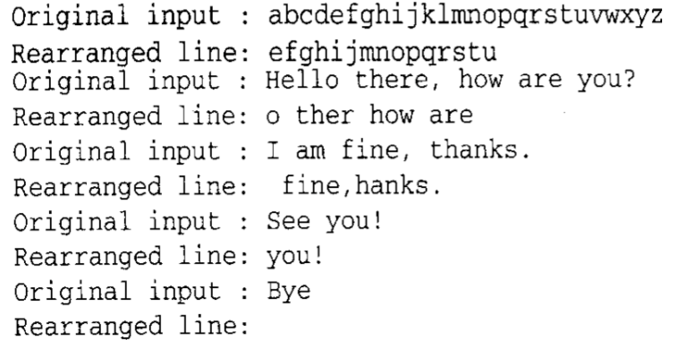

# 快速上手

## 简介

实例： 从标准输入读取文本并对其进行修改，然后把它写到标准输出。例如，如果输入如下：

```
4 9 12 20 -1
abcdefghijklmnopqrstuvwxyz
Hello there, how are you?
I am fine, thanks.
See you!
Bye
```

则程序输出如下：



```c
#include <stdio.h>
#include <stdlib.h>
#include <string.h>

#define MAX_COLS 20  // 所能处理的最大列号
#define MAX_INPUT 1000 // 每个输入行的最大长度

int read_column_numbers( int columns[], int max );
void rearrange( char *output, char const *input, int n_columns, int const columns[] );

int main(int argc, const char * argv[]) {
    
    
    
    int n_columns;  // 进行处理的列标号
    int columns[MAX_COLS];  // 需要处理的列数
    char input[MAX_INPUT];  // 容纳输入行的数组
    char output[MAX_INPUT]; // 容纳输出行的数组
    
    // 读取该串列标号
    n_columns = read_column_numbers(columns, MAX_COLS);
    // 读取处理和打印剩余的输入行
    while(gets(input) != NULL){
        printf("Original input: %s\n", input);
        rearrange(output, input, n_columns, columns);
        printf("Rearranged line: %s\n", output);
    }
    
    
    return EXIT_SUCCESS;
}

// 读取列标号，如果超出范围则不予理会。
int read_column_numbers( int columns[], int max ){
    int num = 0;
    int ch;
    
    // 取得列标号
    while (num < max && scanf("%d", &columns[num]) == 1 && columns[num] >= 0) {
        num += 1;
    }
    
    //  确认已经读取的标号为偶数个，因为它们是以对的形式出现的。
    if (num % 2 != 0) {
        puts("Last column number is not paired");
        exit(EXIT_FAILURE);
    }
    
    while ( (ch = getchar()) != EOF && ch != '\n' ) {
        ;
    }
    
    return num;
    
}

// 处理输入行，将制定列的字符连接在一起，输出行以NUL结尾。
void rearrange( char *output, char const *input, int n_columns, int const columns[] ){
    int col; // columns
    int output_col; // 输出列计数器
    int len; // 输入行的长度
    
    len = strlen(input);
    output_col = 0;
    
    for (col = 0; col < n_columns; col += 2) {
        int nchars = columns[col + 1] - columns[col] + 1;
        
        if (columns[col] >= len || output_col == MAX_INPUT - 1) {
            break;
        }
        
        if (output_col + nchars > MAX_INPUT - 1) {
            nchars = MAX_INPUT - output_col - 1;
        }
        
        strncpy(output + output_col, input + columns[col], nchars);
        
        output_col += nchars;
        
    }
    
    output[output_col] = '\0';
}
```

> 这个程序从标准输入中读取输入行并在标准输出中打印这些输入行，每个输入行的后面一行是该行内容的一部分。

> 输入的第1行是一串列标号，串的最后以一个负数结尾。这些列标号成对出现，说明需要打印的输入行的列的范围。

### 空白和注释

空行将程序的不同部分分隔开来；制表符（tab）用于缩进语句，更好地显示程序的结构等等。C是一种自由格式的语言，并没有规则要求你必须怎样书写语句。然而，如果你在编写程序时能遵守一些约定还是非常值得的，它可以使代码更加容易阅读和修改。

清晰地显示程序的结构固然重要，但是让别人明确代码的意图更加重要。“注释”就是用于这个功能的实现。

```c
// 单行注释
/* 文档注释 */
/* 多行注释
  多行注释 */
```

### 预处理指令

```c
#include <stdio.h>
#include <stdlib.h>
#include <string.h>

#define MAX_COLS 20  // 所能处理的最大列号
#define MAX_INPUT 1000 // 每个输入行的最大长度
```

这5行称为预处理指令（preprocessor directives），因为它们是由预处理器（preprocessor）解释的。预处理器读入源代码，根据预处理指令对其进行修改，然后把修改过的源代码递交给编译器。

预处理器用名为`stdio.h`的库函数头文件的内容替换第一条`#include`指令语句，其结果就仿佛是`stdio.h`内容被逐字写到源文件的那个位置。第2、3条指令的功能类似，只是它们所替换的头文件分别是`stdlib.h`和`string.h`。

`stdio.h`头文件使我们可以访问标准**I/O**库（standard I/O library）中的函数，这组函数用于执行输入和输出。`stdlib.h`定义了`EXIT_SUCCESS`和`EXIT_FAILURE`符号。我们需要`string.h`头文件提供的函数来操纵字符串。

> 在一个文件中编写声明，然后用`#include`指令把这个文件包含到需要使用这些声明的源文件中。这样就只需维护一份代码。

> `#define`，它把名字`MAX_COLS`定义为20，把名字`MAX_INPUT`定义为1000.当这个名字以后出现在源文件的任何地方时，它就会被替换成定义的值。由于它们被定义为字面值常量，所以这些名字不能出现于有些普通变量可以出现的场合（比如赋值运算的左边）。


```c
int read_column_numbers( int columns[], int max );
void rearrange( char *output, char const *input, int n_columns, int const columns[] );
```
这些声明被称为`函数原型（function prototype）`。它们告诉编译器这些以后将在源文件中定义的函数的特征。这样，当这些函数被调用时，编译器就能对它们进行准确性检查。每个原型以一个类型名开头，表示函数返回值类型。跟在返回类型名后面的是函数的名字，再后面是函数期望接受的参数。

### main函数

每个C程序都必须有一个main函数，因为它是程序执行的起点。

