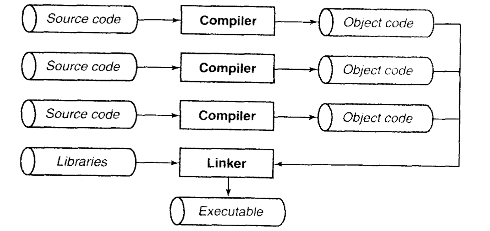
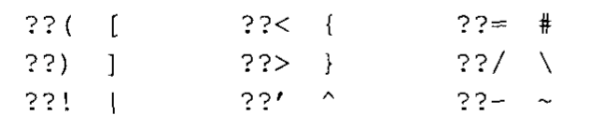

# 基本概念

## 环境

在ANSI C的任何一种实现中，存在两种不同环境。第一种是`翻译环境（translation environment）`，在这个环境里，源代码被转换为可执行的机器指令。第二种是`执行环境（execution environment）`，它用于实际执行代码。标准明确说命名，这两种环境不必谓语同一台机器上。例如，`交叉编译器（cross compiler）`就是在一台机器上运行，但它所产生的可执行代码运行于不同类型的机器上。操作系统也是如此。标准同时讨论了`独立环境（freestanding environment）`，就是不存在操作系统的环境。你可能在嵌入式系统中（如微波炉控制器）遇到这种类型的环境。

### 翻译

翻译阶段由几个步骤组成，组成一个程序的每个（有可能有多个）源文件通过编译过程分别转换为`目标代码（object code）`。然后，各个目标文件由`链接器（linker）`捆绑在一起，形成一个单一而完整的可执行程序。链接器同时也会引入标准C函数库中任何被程序所用到的函数，而且它也可以搜索程序员个人的程序库，将其中需要使用的函数也链接到程序中。



编译过程本身也是由几个阶段组成，首先是`预处理器`处理。这个阶段，预处理器在源代码上执行一些文本操作。例如，用实际值代替由`#define`指令定义的符号以及读入由`#include`指令包含的文件的内容。

然后，源代码经过`解析`，判断它的语句的意思。第二个阶段是产生绝大数错误和警告信息的地方。随后，便产生目标代码。目标代码是机器指令的初步形式，用于实现程序的语句。如果我们在编译程序的命令行中加入了要求进行优化的选项，`优化器`就会对目标代码进一步进行处理，它效率更高。优化过程需要额外的时间，所以在程序调试完毕并准备生成正式产品之前一般不进行这个过程。至于目标代码是直接产生的，还是先以汇编语言语句的形式存在，然后再经过一个独立的阶段编译成目标文件，并不重要。

#### 文件名约定

尽管标准并没有制定文件的取名规则，但大多数环境都存在你必须遵守的文件名命名约定。C源代码通常保存于以`.c`扩展命名的文件中。由`#include`指令包含到C源代码的文件被称为头文件，通常具有扩展名`.h`。

至于目标文件名，不同环境具有不同的约定。例如，在UNIX系统中，它们的扩展名是 `.o`，但是在MS-DOS系统中，它们扩展名为`.obj`。

#### 编译和链接

用于编译和链接C程序的特定命令在不同的系统中各不相同，但许多都和这里所描述的两种系统差不多。在绝大多数UNIX系统中，C编译器被称为`cc`，它可以用多种不同的方法来调用。

1. 编译并链接一个完全包含于一个源文件的C程序：
```sh
cc program.c
```
这条命令产生一个称为a.out的可执行程序。中间会产生一个名为program.o的目标文件，但它在链接过程完成后会被删除。

2. 编译并链接几个C源文件：
```sh
cc main.c sort.c lookup.c
```
当编译的源文件超过一个时，目标文件便不会被删除。这就允许你对程序进行修改后，只对那些进行过改动的源文件进行重新编译，如下一条命令所示。

3. 编译一个C源文件，并把它和现存的目标文件链接在一起：
```sh
cc main.o lookup.o sort.c
```

4. 编译单个C源文件，并产生一个目标文件，以后再进行链接：
```sh
cc -c program.c
```

5. 编译几个C源文件，并为每个文件产生一个目标文件：
```sh
cc -c mian.c sort.c lookup.c
```

6. 链接几个目标文件
```sh
cc main.o sort.o lookup.o
```

上面那些可以产生可执行程序的命令均可以加上`-o name`这个选项，它可以使链接器把可执行程序保存在“name”文件中，而不是“a.out”。在缺省情况下，链接器在标准C函数库中查找。如果在编译时加上“-lname”标志，链接器就会同时在“name”的函数库中进行查找。这个选项应该出现在命令行的最后。除此之外，还有很多选项，可通过查看系统文档了解。

### 执行

程序的执行过程也需要经历几个阶段。首先，程序必须载入到内存中。在宿主环境中（也就是具有操作系统的环境），这个任务由操作系统完成。那些不是存储在堆栈中的尚未初始化的变量将在这个时候得到初始值。在独立环境中，程序的载入必须由手工安排，也可能是通过把可执行代码置入只读内存（ROM）来完成。

然后，程序的执行便开始。在宿主环境中，通常一个小型的启动程序与程序链接在一起。它负责处理一系列日常事务，如收集命令行参数以便使程序能够访问它们。接着，便调用`main`函数。

现在，便开始执行程序代码。在绝大多数机器里，程序将使用一个运行时`堆栈`，它用于存储函数的局部变量和返回地址。程序同时也可以使用`静态`内存，存储于静态内存中的变量在程序的整个执行过程中将一直保留它们的值。

程序执行的最后一个阶段就是程序的终止，它可以由多种不同的原因引起。“正常”终止就是`main`函数返回。有些执行环境允许程序返回一个代码，提示程序为什么停止执行。在宿主环境中，启动程序将再次取得控制权，并可能执行各种不同的日常任务，如关闭那些程序可能使用过但并未显示关闭的任何文件。除此之外，程序也可能是由于用户按下break键或者电话连接的挂起而终止，另外也可能是由于在执行过程中出现的错误而自行中断。

## 词法规则

词法规则，像英语中的拼写规则，决定你在源程序中如何形成单独的字符片段，也就是`标记`。

一个ANSI C程序由声明和函数组成。函数定义了需要执行的工作，而声名则描述了函数和函数将要操作的数据类型（有时候是数据本身）。注释可以散布于源文件的各个地方。

### 字符

标准并没有规定C环境必须使用哪种特定的字符集，但它规定字符集必须包括英语所有大小写字母，数字0到9，以及`!"'#%'()*+,-./:;<>=?[]\^_{}|~`。

换行符用于标志源代码每一行的结束，当正在执行的程序的字符输入就绪时，它也用于标志每个输入行的末尾。如果运行时环境需要，换行符也可以是一串字符，但它们被当作单个字符处理。字符集还必须包括空格、水平制表符、垂直制表符和格式反馈字符。这些字符加上换行符，通常被称作空白字符，因为当它们被打印出来时，在页面上出现的是空白而不是各种记号。

标准还定义了几个`三字母词`，三字母词就是几个字符的序列，合起来表示另一个字符。三字母词使C环境可以在某些缺少一些必须字符的字符集上实现。这里列出一些三字母词以及它们所代表的的字符。



### 注释

```c
// 单行注释

/*
多行注释
多行注释
*/
```

### 标识符

标识符是具有一定规则的字符，用来对变量、符号常量名、函数、数组、类型等命名。简单来说，标识符就是一个对象的名字。

命名规则：

- 以字母数字和下划线组成
- 首字母只能是字母或下划线
- 不能以系统关键字作为标识符
- 严格区分大小写
- 应做到见名知意

