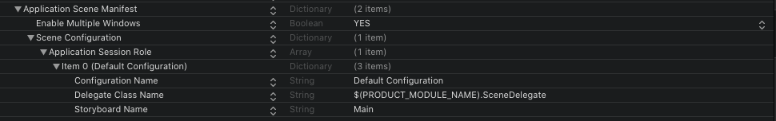
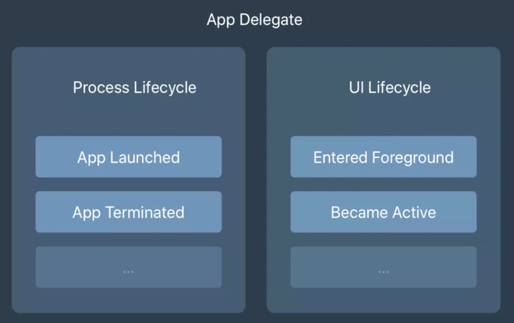
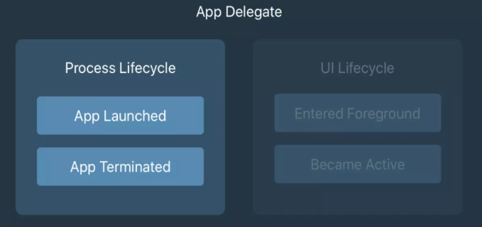
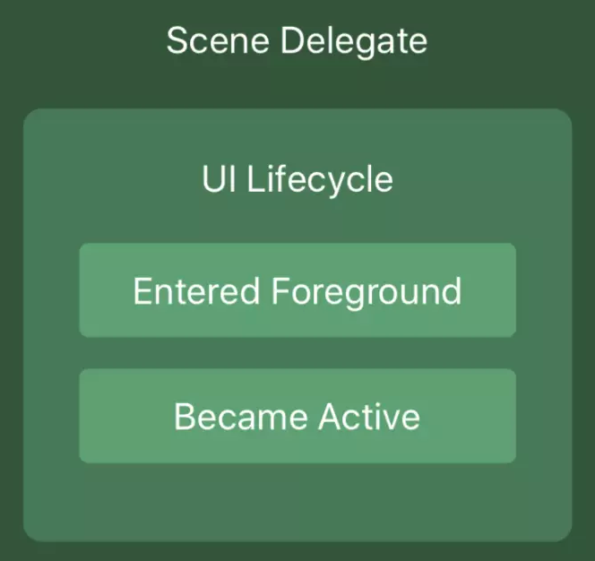

# SceneDelegate

iOS13 之后，在创建项目时 info.plist 会多出一个名为 **`Application Scene Manifest`**:



- Configuration Name：场景配置的唯一标识；
- Delegate Class Name：实现 UIWindowSceneDelegate 代理类的名称；
- Storyboard Name：Storyboard 的名称（如果采用的是 Storyboard 方式实现 UI)，可选。

该键值为`scenes`指定名称和委托类。请注意，这些属性属于一个数组（Application Session Role），表明您可以在中拥有多个配置 Info.plist。您可能已经在上面的屏幕快照中发现了一个更重要的键 Enable Multiple Windows。此属性 NO 默认设置为。将此属性设置为，YES 将允许用户在 iPadOS（甚至在 macOS）上打开应用程序的多个`window`。能够并排运行 iOS 应用程序的多个`window`与迄今为止我们使用的单个`window`环境有很大的不同，并且具有多个`window`的能力是我们的应用程序生命周期现在维持在两个地方的全部原因而不是一个。

## AppDelegate 和 SceneDelegate

### Before iOS13



iOS13 之前，**`AppDelegate`** 的职责是全权处理 App 生命周期和 UI 生命周期，**`AppDelegate`** 类实现了 **`UIKit`** 库中的 **`UIApplicationDelegate`** 协议。他是 app 的入口，app 启动后首先调用的方法为：

```
application(_:didFinishLaunchingWithOptions:)

```

在 `didFinishLaunchingWithOptions` 启动入口方法中，进行初始化数据库，启动必要的服务，注册通知等基础工作，然后创建 `UIWindow` ，执行 `UIWindow的makeKeyAndVisible` 方法，即将页面显示在屏幕上。

除了 `didFinishLaunchingWithOptions` 启动入口方法，`UIApplicationDelegate` 还提供有一系列的方法以供管理 APP 的生命周期：

```
func applicationWillResignActive(_ application: UIApplication) {
    //即将变为非活动状态
}

func applicationDidEnterBackground(_ application: UIApplication) {
    //已进入后台
}

func applicationWillEnterForeground(_ application: UIApplication) {
    //即将进入前台
}

func applicationDidBecomeActive(_ application: UIApplication) {
    //已进入前台，成为活跃进程
}

func applicationWillTerminate(_ application: UIApplication) {
    //进程终止
}
```

总结：iOS 13 以前 **`AppDelegate`** 中主要完成：

- 创建 app 的第一个 **`view controller`** 也就是 **`rootViewController`**

- 配置并启动一些像日志记录和云服务等组件

- 注册推送通知处理程序，并响应发送到 app 的推送通知

- 响应应用程序生命周期事件，例如进入后台，恢复应用程序或退出应用程序（终止）

### after iOS13





在 iOS 13（及以后版本）上，**`SceneDelegate`** 将负责 **`AppDelegate`** 的某些功能。 **`window（`window`）`** 的概念已被 **`scene（`scenes`）`** 的概念所代替。

一个应用程序可以具有多个`scenes`，而一个`scenes`现在可以作为您应用程序的用户界面和内容的载体（背景）。`scenes`包含用于呈现您的 UI 实例的`window`和视图控制器。每个`scenes`还具有一个对应的对象，您可以使用该对象来协调 UIKit 与应用程序之间的交互。`scenes`彼此并发运行，共享相同的内存和应用程序处理空间。

在 iOS 13 以后，原有的 UIApplicationDelegate UI 生命周期的几个方法将拆分到 UISceneDelegate 中：

```
SceneDelegate.swift

// 连接会话场景,新建窗口时调用
scene(_:willConnectTo:options:)
// 场景即将进入前台
sceneWillEnterForeground(_:)
// 场景已经处于活跃状态
sceneDidBecomeActive(_:)

// 场景即将进入后台
sceneWillResignActive(_:)
// 场景已经进入后台
sceneDidEnterBackground(_:)
// 场景断开连接
sceneDidDisconnect(_:)

AppDelegate.swift

//新建场景，返回场景配置
func application(_ application: UIApplication, configurationForConnecting connectingSceneSession: UISceneSession, options: UIScene.ConnectionOptions) -> UISceneConfiguration {

    return UISceneConfiguration(name: "Default Configuration", sessionRole: connectingSceneSession.role)
}

//场景关闭时调用
func application(_ application: UIApplication, didDiscardSceneSessions sceneSessions: Set<UISceneSession>) {
}

```

`UIApplicationDelegate` 提供的 `applicationWillTerminate` 接口保持不变，即 `UIApplicationDelegate` 不再负责 UI 的生命周期，仅负责 APP 的生命周期，包括启动和终止。

#### AppDelegate

`AppDelegate` 方法几个应用程序级生命周期事件。在 Apple 的默认模板中的三个方法：

```
func application(_:didFinishLaunchingWithOptions:) -> Bool
func application(_:configurationForConnecting:options:) -> UISceneConfiguration
func application(_:didDiscardSceneSessions:)
```

刚启动应用程序时，将`func application(_:didFinishLaunchingWithOptions:) -> Bool`被调用。此方法用于执行应用程序设置。

在 iOS 12 或更早版本中，您可能已使用此方法创建和配置 `UIWindow` 对象， `UIViewController` 并向该`window`分配了一个实例以使其显示。如果您的应用程序使用 `Scene` ，则 `AppDelegate` 将不再负责上述任务。由于应用程序现在可以具有多个 `window` 或 `UISceneSession` 处于活动状态，因此在 `AppDelegate` 中管理单个`window`对象没有多大意义。

`func application(_:configurationForConnecting:options:) -> UISceneConfiguration` 每当期望您的应用程序提供新`scenes`或供 iOS 显示的`window`时，就会调用。请注意，当您的应用程序最初启动时，不会调用此方法，只会调用它来获取和创建新`scenes`。

`AppDelegate` 模板中的最后一个方法是 `func application(_:didDiscardSceneSessions:)`。每当用户丢弃`scenes`时（例如，通过在多任务`window`中将其滑动或以编程方式关闭），都会调用此方法。如果用户执行此操作时您的应用未运行，则在 app 运行后，将为每个丢弃的`scenes`调用此方法 `func application(_:didFinishLaunchingWithOptions:) -> Bool`。

#### SceneDelegate

`SceneDelegate` 就是负责屏幕上显示的内容，`scenes`或`window`。

在处理`scenes`时，对用户来说看起来像是一个`window`的 `window` 实际上称为 a UIScene，由 a 管理 UISceneSession。因此，当我们指代`window`时，实际上是指 UISceneSession 对象。

SceneDelegate 默认有以下几个方法：

```
iOS后场景声明周期

// 连接会话场景,新建窗口时调用
scene(_:willConnectTo:options:)
// 场景即将进入前台
sceneWillEnterForeground(_:)
// 场景已经处于活跃状态
sceneDidBecomeActive(_:)

// 场景即将进入后台
sceneWillResignActive(_:)
// 场景已经进入后台
sceneDidEnterBackground(_:)
// 场景断开连接
sceneDidDisconnect(_:)

```

`scene(_:willConnectTo:options:)` 会创建您的初始内容视图，创建一个 `new UIWindow`，设置该窗口的 `rootViewController` 并使该窗口成为 `key window`。您可能会将此窗口认为是用户看到的窗口。事实并非如此。Windows 自 iOS 13 之前就存在，它们代表您的应用程序在其中运行的视口。因此， · 控制用户看到的可见窗口，您创建的 `UIWindow` 就是应用程序的容器视图。

除了设置初始视图之外， `scene(_:willConnectTo:options:)` 还可以用来还原场景 UI，以防场景断开连接。例如，它被发送到后台。您还可以阅读该 `connectionOptions` 对象，以查看您的场景是由于 `HandOff` 请求创建的，还是打开 URL 的。

连接场景后，场景生命周期中的下一个方法是 `sceneWillEnterForeground(_:)` 。当场景转到前台时，将调用此方法。这可能是您的应用程序从后台过渡到前台时，或者刚开始处于活动状态时。接下来， `sceneDidBecomeActive(_:)` 被调用。这时该场景可见并可以被使用。

`sceneDidDisconnect(_:)` 每当场景进入后台时，iOS 可能会断开连接清理场景去释放资源。这并不意味着你的 app 被杀死，只是简单的意味着传递进该方法的场景不在活动，并将与会话断开连接。

`sceneDidDisconnect(_:)` 丢弃不需要保留的资源。这些可能是易于从磁盘或网络加载的数据，也可能是您可以轻松重新创建的其他数据。确保保留无法轻易重新创建的数据也很重要，例如，用户在场景中提供的任何输入（他们希望返回场景时仍会保留在场景中）。

假如有一个支持多个场景的文本处理应用程序。如果用户正在一个场景中工作，然后将其作为背景，以便在 Safari 上进行一些研究并更改 Spotify 中的音乐，那么即使 iOS 可能断开了文本处理，他们也绝对希望所有工作仍存在于文本处理应用程序中应用的场景有一段时间。为此，应用程序必须保留所需的数据，并且应在 NSUserActivity 对象中对当前应用程序状态进行编码，以便在以后 `scene(_:willConnectTo:options:)` 重新连接场景时可以读取该对象。

### 场景设置（scene setup）

有一些原因需要你必须去执行额外的设置，你可能必须要打开一个 URL，或者处理切换请求和状态还原。

当场景断开连接并被 `sceneDidDisconnect(_:)` 调用时，状态恢复即开始。在这一点上最重要的是应用程序已经设置了可以稍后恢复的状态。最好的方法是在您的应用程序中使用 [`NSUserActivity`](https://developer.apple.com/documentation/foundation/nsuseractivity) 。

当您需要提供可以在以后恢复的用户活动时，系统会调用 `SceneDelegate` 的 `stateRestorationActivity(for:)` 方法。请注意，此方法不是默认模板的一部分。

## 适配

使用 `SceneDelegate` 之后， `UIApplicationDelegate` 将不再持有 `UIWindow` ，它将转移至 `UIWindowSceneDelegate` 代理中。由于 iOS 目前还不支持多窗口，所以大部分情况下 iOS 项目仅需要一个场景配置。

**didFinishLaunchingWithOptions**

`AppDelegate` 中， `didFinishLaunchingWithOptions` 仅负责处理除 UI 之外的初始化工作：

```
func application(_ application: UIApplication, didFinishLaunchingWithOptions launchOptions: [UIApplication.LaunchOptionsKey: Any]?) -> Bool {
    // init database，register notification，and so on.
    return true
}
```

**configurationForConnecting**

iOS 13 系统将调用 `configurationForConnecting` 接口，返回 `UISceneConfiguration` 对象，创建 scene。

```
func application(_ application: UIApplication, configurationForConnecting connectingSceneSession: UISceneSession, options: UIScene.ConnectionOptions) -> UISceneConfiguration {

    if let activity = options.userActivities.first, activity.activityType == "com.easeapi.scene0" {
        return UISceneConfiguration(name: "scene0", sessionRole: connectingSceneSession.role)
    }

    return UISceneConfiguration(name: "scene1", sessionRole: connectingSceneSession.role)
}
```

`UISceneSession` 是管理 `scene` 的实例，一个 `scene` 对应一个 `UISceneSession` ， `UISceneSession` 包含唯一标识和场景的配置细节。 `UISceneSession` 的生命周期由 UIKit 维护，当 `scene` 关闭时 `UISceneSession` 销毁。开发者无法直接创建 `UISceneSession` ，除了在 `configurationForConnecting` 接口由系统传入 `UISceneSession` 的实例外，开发者也可以通过 `UIApplication.shared.requestSceneSessionActivation` 的方式动态创建新的场景。

`UIScene.ConnectionOptions` 则提供了创建场景时携带的额外信息，以便启动不同的场景配置。

**willConnectTo**

接着系统将在场景配置 list 中找到 Configuration Name（scene0）指定的 Delegate Class Name（Scene0Delegate），控制权交由 Scene Delegate，将执行 willConnectTo 方法，在这个方法中完成创建 UIWindow 的操作。

```
func scene(_ scene: UIScene, willConnectTo session: UISceneSession, options connectionOptions: UIScene.ConnectionOptions) {
    if let windowScene = scene as? UIWindowScene {
        let window = UIWindow(windowScene: windowScene)
        window.rootViewController = ViewController()
        window.backgroundColor = .white
        self.window = window
        window.makeKeyAndVisible()
    }
}
```

之后，页面进入前后台的事件全由 `Scene Delegate` 接管。在上述示例中， `configurationForConnecting` 方法中有区分是走 `scene0` 场景还是 `scene1` 场景， `options` 的参数是调用时传递的：当直接打开 APP 时， `options` 中数据为空；通过`UIApplication.shared.requestSceneSessionActivation` 方式切换场景时，`options` 将包含携带的用户数据。

## iOS 各个版本的适配

由于 Scene Delegate 仅在 iOS 13 获得支持，iOS 13 之前的系统还是需要走 UIApplicationDelegate 相关的方法。两个方案可供适配：

- 不支持 Scene Delegate：直接删除 Info.plist 的 Application Scene Manifest 节点，回到使用 UIApplicationDelegate 的方式；
- 支持 Scene Delegate：通过#available(iOS 13.0, \*)等方式区分版本，iOS 13 之前系统走原始的 UIApplicationDelegate，iOS 13 之后走 Scene Delegate。

## iPadOS 多窗口

自 iOS 13 开始，苹果推出了 iPad 专用的 iPadOS 系统，表明了苹果将 iPad 打造成生产力工具的野心。期待已久的 multiple windows 功能终于在 iPadOS 13 上得以实现。

上面讲到的 iOS 适配 Scene Delegate 是非常简单的，就是将 UIWindow 的创建及 UI 生命周期管理放置在 Scene Delegate 中，其它的比如页面栈管理等和之前完全一样。Scene Delegate 的更大的用途是用来支持 iPadOS 的多窗口。

想要 iPad App 获得多窗口的能力非常简单，在 Xcode 项目中勾选“Supports multiple windows”即可，运行打开 APP->选中 APP 长按->Show All Windows->点击屏幕右上角+号，即可新建一个窗口。

就是这么简单，你甚至不需要添加任何代码就可实现多窗口的能力。但我们的需求肯定不止于此，我们还需要在代码中控制窗口的新建，关闭以及用户数据交互。苹果提供了简洁的接口方便我们编程控制。

### 新建 scene

```
let activity = NSUserActivity(activityType: "com.easeapi.scene0")
activity.userInfo = ["website": "http://easeapi.com/blog"]
UIApplication.shared.requestSceneSessionActivation(nil, userActivity: activity, options: nil, errorHandler: nil)
```

为了达到各个场景之间切换时状态保留的目的，用户数据的传递就变得非常关键。苹果使用 NSUserActivity（iOS 8 加入的，很多地方都用到了）来存储用户数据。NSUserActivity 亦可从 UISceneSession 的 stateRestorationActivity 方法获取，典型的使用场景如下：

```
func scene(_ scene: UIScene, willConnectTo session: UISceneSession, options connectionOptions: UIScene.ConnectionOptions) {
    let vc: ViewController
    if let activity = connectionOptions.userActivities.first ?? session.stateRestorationActivity,
    let identifier = activity.targetContentIdentifier {
        vc = ViewController(catName: identifier)
    } else {
        vc = ViewController(catName: "default")
    }

    if let windowScene = scene as? UIWindowScene {
        let window = UIWindow(windowScene: windowScene)
        window.rootViewController = vc
        window.backgroundColor = .white
        self.window = window
        window.makeKeyAndVisible()
    }
}
```

这样就可以在载入场景时获得暂存的用户数据，以便 UI 平滑过渡。关于 NSUserActivity 的内容可以参考[文档](https://developer.apple.com/documentation/foundation/nsuseractivity)。

### 关闭

```
if let session = self.view.window?.windowScene?.session {
    let options = UIWindowSceneDestructionRequestOptions()
    options.windowDismissalAnimation = .commit
    UIApplication.shared.requestSceneSessionDestruction(session, options: options, errorHandler: nil)
}
```
